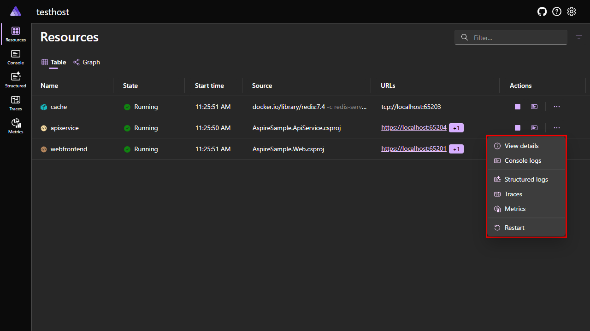
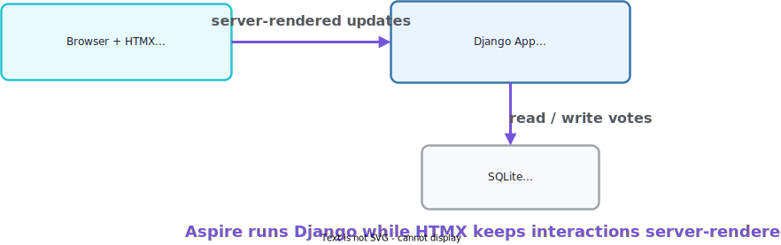
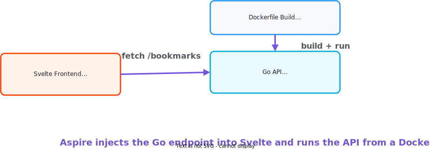
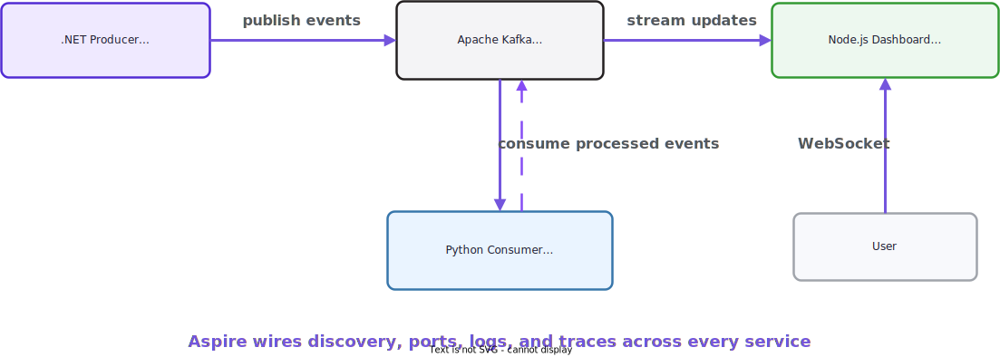
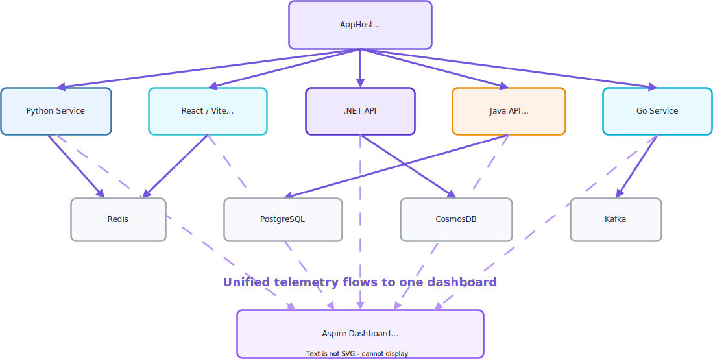
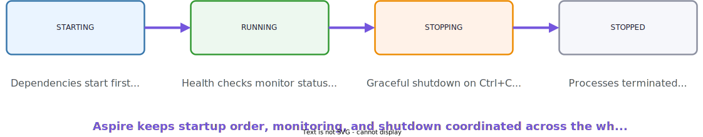

<!-- _footer: 'https://github.com/codebytes/aspire-polyglot' -->
<!-- _class: lead -->

# <!--fit--> Polyglot Aspire

## Orchestrating Any Language with Aspire
## Chris Ayers


---


## Chris Ayers

### Principal Software Engineer<br>Azure CXP AzRel<br>Microsoft

<i class="fa-brands fa-bluesky"></i> BlueSky: [@chris-ayers.com](https://bsky.app/profile/chris-ayers.com)
<i class="fa-brands fa-linkedin"></i> LinkedIn: - [chris\-l\-ayers](https://linkedin.com/in/chris-l-ayers/)
<i class="fa fa-window-maximize"></i> Blog: [https://chris-ayers\.com/](https://chris-ayers.com/)
<i class="fa-brands fa-github"></i> GitHub: [Codebytes](https://github.com/codebytes)
<i class="fa-brands fa-mastodon"></i> Mastodon: [@Chrisayers@hachyderm.io](https://hachyderm.io/@Chrisayers)

---

# The Polyglot Problem

Your team doesn't use one language — it uses **five**.

<div class="columns">
<div>

**Your stack today**
- Python ML services
- Go microservices
- Java Spring Boot APIs
- TypeScript/React frontends
- .NET backend APIs

</div>
<div>

**Your orchestration pain**
- Docker Compose: manual port wiring, no built-in telemetry, no health-aware startup ordering
- Each language has its own config format (`.env`, YAML, `application.properties`...)
- No unified observability — good luck tracing a request across 4 services
- 15-step README to run locally — "just `docker-compose up`" never works first time

</div>
</div>

**The question:** How do you orchestrate, observe, and wire all of this **from one place**?

<!-- We've all been there: README says "just run docker-compose up" but it never works the first time. Each language has its own logging, its own config format, its own service discovery pattern. You end up with hardcoded URLs everywhere. -->

---

<!-- _class: gradient -->

# <!--fit--> Aspire: The Polyglot Answer

<!-- Transition from problem to solution -->

---

<!-- _class: compact code-compact -->

# One Orchestrator for Every Language

**Aspire gives you three things, regardless of language:**

<div class="columns">
<div>

🎯 **Orchestration**
Define your entire stack — Python, Go, Java, TypeScript, .NET — in one AppHost file

📡 **Service Discovery**
Endpoints and connection strings auto-injected as environment variables

📊 **Observability**
One dashboard for logs, traces, and metrics across ALL services via OpenTelemetry

</div>
<div>

```csharp
var builder = DistributedApplication.CreateBuilder(args);

var redis = builder.AddRedis("cache");
var postgres = builder.AddPostgres("db")
                      .AddDatabase("appdata");

builder.AddUvicornApp("ml-service", "../python", "main:app")
       .WithUv()
       .WithReference(redis);

builder.AddViteApp("frontend", "../react")
       .WithHttpEndpoint(env: "PORT")
       .WithReference(postgres);

builder.AddProject<Projects.Api>("api")
       .WithReference(redis)
       .WithReference(postgres);

builder.Build().Run();
```

</div>
</div>

<!-- This is the Aspire AppHost. It's the central brain that starts everything and wires it together. Python, React, .NET — all visible in one dashboard, auto-wired, observable. No .NET SDK required for non-.NET devs if you use a polyglot AppHost. -->

---

<!-- _class: compact code-compact -->

# The AppHost — Your Stack in Code

**Write your AppHost in the language your team knows:**

<div class="columns">
<div>

**C# AppHost**
```csharp
var builder = DistributedApplication
    .CreateBuilder(args);

var redis = builder.AddRedis("cache");

builder.AddPythonApp("api", "../api", "app.py")
       .WithReference(redis)
       .WithHttpEndpoint(env: "PORT");

builder.Build().Run();
```

</div>
<div>

**TypeScript AppHost**
```typescript
const builder = await createBuilder();

const redis = await builder.addRedis("cache");

await builder
  .addPythonApp("api", "../api", "app.py")
  .withReference(redis)
  .withHttpEndpoint({ env: "PORT" });

await builder.build().run();
```

</div>
</div>

**Same 40+ integrations** — Redis, Azure, Kafka, MongoDB, PostgreSQL — available in both C# and TypeScript.

<!-- The TypeScript AppHost uses the same integration packages as C#, auto-generated via [AspireExport] attributes. A JS/TS team never needs to touch .NET. -->

---

<!-- _class: dense code-compact -->

# AppHost Languages

**Pick the language your team already knows:**

<div class="columns">
<div>

🟦 **TypeScript** — `apphost.ts`
```typescript
await builder.addNodeApp("api", "./src", "server.js")
  .withHttpEndpoint({ env: "PORT" });
```

💜 **C# (.NET)** — `AppHost.cs`
```csharp
builder.AddProject<Projects.Api>("api")
       .WithHttpEndpoint(env: "PORT");
```

**All  produce the same result:**
Dashboard, service discovery, and telemetry work **identically**. C# has the richest typed integrations; other SDKs use `addDockerfile`/`addContainer` as universal building blocks.

</div>
<div>

🐍 **Python** — `apphost.py` **EXPERIMENTAL**
```python
api = builder.add_dockerfile("api", "./src")
api.with_http_endpoint(target_port=8080, env="PORT")
```

☕ **Java** — `AppHost.java` **EXPERIMENTAL**
```java
builder.addDockerfile("api", "./src", null, null)
  .withExternalHttpEndpoints();
```


🟢 **Go** — `apphost.go` **EXPERIMENTAL**
```go
api, _ := builder.AddDockerfile("api", "./src", nil, nil)
api.WithHttpEndpoint(nil, float64Ptr(8080), stringPtr("http"), nil, nil)
```

</div>
</div>

<!-- Each language has its own idioms — Python uses snake_case, TypeScript uses camelCase, Go returns errors — but the Aspire model is the same everywhere. The C# SDK has the most typed integrations, but all five languages can orchestrate any service via Dockerfile or container. -->

---

<!-- _class: compact code-compact -->

# `aspire.config.json` — One Config for Every Language

**This file tells the CLI which language your AppHost uses:**

```json
{
  "appHost": { "path": "apphost.py", "language": "python" },
  "sdk": { "version": "13.2.0" },
  "channel": "stable",
  "features": { "polyglotSupportEnabled": true },
  "profiles": {
    "default": {
      "applicationUrl": "https://localhost:17000;http://localhost:15000"
    }
  }
}
```

<div class="columns">
<div>

**What it does:**
- `appHost.path` + `appHost.language` — declares your stack
- `sdk.version` — pins the Aspire SDK version (e.g. `13.2.0`)
- `channel` — release channel (`stable`, `preview`)
- `profiles` — dashboard URLs (replaces `apphost.run.json`)
- Feature flags use **boolean `true`** (not string `"true"`)

</div>
<div>

**Manage from CLI:**
- `aspire config list` / `get` / `set`
- `aspire secret set/list/get/delete`
- `aspire certs clean/trust`

**Every sample in this talk** has one at its root.

</div>
</div>

<!-- This is the key file. Drop aspire.config.json in your project root, point it at your AppHost file, set the language, and aspire run just works. The CLI reads this to know how to build and launch your app. -->

---

<!-- _class: invert -->

# <!--fit--> How It Works

The three patterns that make polyglot orchestration possible

<!-- Now let's look at the three mechanisms that power everything: service discovery, connection strings, and the dashboard. These work the same regardless of AppHost language. -->

---

# Service Discovery

**Aspire injects service endpoints as environment variables:**

```bash
# Pattern: services__<name>__<protocol>__<index>
services__api__http__0=http://localhost:5000
services__frontend__http__0=http://localhost:3000
```

**Read them in any language — same pattern everywhere:**

<div class="columns">
<div>

**Python:**
```python
api_url = os.environ['services__api__http__0']
requests.get(f'{api_url}/data')
```

**Go:**
```go
apiURL := os.Getenv("services__api__http__0")
```

</div>
<div>

**Node.js:**
```javascript
const apiUrl = process.env['services__api__http__0'];
await fetch(`${apiUrl}/data`);
```

**Java:**
```java
String apiUrl = System.getenv("services__api__http__0");
```

</div>
</div>

**No hardcoded URLs. No `.env` files. Aspire wires it.**

<!-- This is the magic. The double underscore __ is used because environment variables can't have colons. Every language can read env vars — that's the universal interface. -->

---

<!-- _class: compact code-compact -->

# Connection Strings

**Infrastructure resources get connection strings automatically:**

```bash
# Pattern: CONNECTIONSTRINGS__<resource>
CONNECTIONSTRINGS__cache=localhost:6379
CONNECTIONSTRINGS__db=Host=localhost;Port=5432;Username=postgres;Password=...
CONNECTIONSTRINGS__messaging=localhost:9092
```

**Same pattern in every language:**

```python
# Python — Redis
client = redis.from_url(f"redis://{os.environ['CONNECTIONSTRINGS__cache']}")
```

```javascript
// Node.js — Kafka
const kafka = new Kafka({ brokers: [process.env.CONNECTIONSTRINGS__messaging] });
```

```java
// Java — PostgreSQL via env vars
String url = "jdbc:postgresql://" + System.getenv("PG_HOST") + ":" + System.getenv("PG_PORT") + "/" + System.getenv("PG_DB");
```

**Aspire injects environment variables** — your service reads them using its language's standard env var mechanism.

<!-- Aspire handles the complexity of connection strings so you don't have to manage .env files. For C# AppHosts using AddPostgres, connection strings are auto-generated. For polyglot AppHosts, you wire env vars explicitly — same result, more control. -->

---

<!-- _class: compact -->

# The Dashboard — One View for Everything

**Same dashboard regardless of what language your services use:**

<div class="columns">
<div>

📋 **Resources** — All services, containers, status, endpoints
📜 **Console Logs** — Real-time stdout/stderr from every process
📊 **Structured Logs** — Parsed JSON logs, filter by level
🔍 **Traces** — Distributed request tracing across services
📈 **Metrics** — Latency, CPU/memory, custom metrics

</div>
<div>



Aspire sets `OTEL_EXPORTER_OTLP_ENDPOINT` automatically — add OpenTelemetry to your service and traces flow to the dashboard.

</div>
</div>

<!-- This is the killer feature. One dashboard for everything, regardless of language. Click a trace to see the full waterfall across Python, .NET, and Node.js. Export as .env for local debugging. -->

---

<!-- _class: compact code-compact -->

# CLI for Every Language

**No .NET SDK required** — the Aspire CLI is a standalone binary.

[http://get.aspire.dev](http://get.aspire.dev)

```bash
# Install
irm https://aspire.dev/install.ps1 | iex         # Windows
curl -sSL https://aspire.dev/install.sh | bash  # macOS / Linux
```

<div class="columns">
<div>

**Day-to-day workflow**
```bash
aspire run              # Start everything
aspire start            # Start in background
aspire ps               # List running apps
aspire stop             # Stop everything
aspire describe --follow  # Watch resources live
```

</div>
<div>

**Diagnostics & maintenance**
```bash
aspire doctor           # Check SDK, certs, Docker, WSL2
aspire restore          # Regenerate SDK code
aspire export           # Capture telemetry to zip
aspire update           # Update integrations
aspire otel             # View OpenTelemetry data
aspire logs             # Display resource logs
aspire docs search "redis"  # Docs from terminal
```

</div>
</div>

**Works identically** whether your AppHost is TypeScript or C#.

<!-- The standalone CLI bundles DCP — the Developer Control Plane. A Python or Java developer uses the exact same commands as a .NET developer. aspire doctor is great for troubleshooting environment issues before a talk or demo. -->

---

<!-- _class: compact code-compact -->

# `aspire new` — Language-Aware Scaffolding

**Start a new project in your team's language:**

```bash
aspire new aspire-py-starter -n my-app   # Python (FastAPI/React)
aspire new aspire-ts-starter -n my-app   # TypeScript (Express/React)
aspire new aspire-starter -n my-app      # C# (ASP.NET Core/Blazor)
```

```bash
cd my-app && aspire run   # Runs immediately — no extra setup
```

**What you get:**
- AppHost file in your chosen language
- `aspire.config.json` pre-configured
- Sample service wired up with service discovery
- Dashboard ready on first run

<!-- aspire new is language-aware — it scaffolds the right AppHost structure for your chosen language. This is the fastest way to start a polyglot project. -->

---

<!-- _class: purple -->

# <!--fit--> Demos

8 samples — live with the Aspire dashboard

<!-- Time to see Aspire in action! We'll walk through 8 samples — each running live with the Aspire dashboard. Watch for: service startup ordering, cross-language logs, and the unified trace view. -->

---

<!-- _class: compact -->

# 8 Live Demos

<div class="columns">
<div>

🟦 **TypeScript AppHosts**
1. **ts-starter** — Express + React
2. **vite-react-api** — FastAPI + React + Redis

🐍 **Python AppHosts**
3. **flask-markdown-wiki** — Flask + Redis
4. **django-htmx-polls** — Django + HTMX + PostgreSQL

</div>
<div>

☕ **Java / 🟢 Go AppHosts**
5. **spring-boot-postgres** — Spring Boot + PostgreSQL
6. **svelte-go-bookmarks** — Go API + Svelte + PostgreSQL

💜 **C# AppHosts**
7. **dotnet-angular-cosmos** — Angular + .NET + CosmosDB
8. **polyglot-event-stream** — .NET + Python + Node.js + Kafka

</div>
</div>

<!-- Each demo runs live with the Aspire dashboard — same CLI, same dashboard, different languages. -->

---

<!-- _class: compact -->

# Demo: TypeScript Starter

**TypeScript AppHost** → Express API + React Frontend


<!-- The simplest polyglot demo. TypeScript AppHost with auto-wired API and frontend. -->

---

<!-- _class: compact -->

# Demo: Vite React + FastAPI

**TypeScript AppHost** → React Frontend + Python FastAPI + Redis


<!-- Full-stack TypeScript-orchestrated app with Python backend and Redis caching. -->

---

<!-- _class: compact -->

# Demo: Flask Markdown Wiki

**Python AppHost** → Flask Wiki App + Redis Cache


<!-- Python orchestrating Python — the AppHost and the service are both Python. -->

---

<!-- _class: compact -->

# Demo: Django HTMX Polls

**Python AppHost** → Django + HTMX + PostgreSQL



<!-- Real-time voting with HTMX partial updates, Django backend, PostgreSQL persistence. -->

---

<!-- _class: compact -->

# Demo: Spring Boot Notes

**Java AppHost** → Spring Boot API + PostgreSQL


<!-- Java orchestrating Java — experimental Java AppHost with Spring Boot and PostgreSQL. -->

---

<!-- _class: compact -->

# Demo: Svelte + Go Bookmarks

**Go AppHost** → Go REST API + Svelte Frontend + PostgreSQL



<!-- Go orchestrating a full-stack app — Go API backend with Svelte frontend. -->

---

<!-- _class: compact -->

# Demo: Angular + .NET + CosmosDB

**C# AppHost** → Angular Frontend + .NET API + Azure CosmosDB


<!-- Classic .NET AppHost orchestrating Angular frontend with CosmosDB emulator. -->

---

<!-- _class: compact -->

# Demo: Polyglot Event Stream

**C# AppHost** → .NET Producer + Python Consumer + Node.js Dashboard + Kafka



<!-- The ultimate polyglot demo — three languages, one event pipeline, full distributed tracing. -->

---

<!-- _class: gradient -->

# <!--fit--> Wrap-Up

---

# Key Takeaways

🌍 **Aspire is a polyglot orchestrator** — not just for .NET

🗣️ **AppHost languages** — C# ✅, TypeScript (preview), Python/Go/Java (experimental)

📡 **Universal patterns** — `services__name__http__0` and `CONNECTIONSTRINGS__resource` work in every language

📊 **One dashboard** — Logs, traces, metrics across all services via OpenTelemetry

🛠️ **Standalone CLI** — `aspire run` / `aspire doctor` / `aspire new` — no .NET SDK required

📦 **40+ integrations** — Redis, Kafka, PostgreSQL, CosmosDB — richest in C#, growing in all SDKs

🚀 **Deploy anywhere** — Same AppHost model for local dev, staging, and production

🔓 **Open source** — [github.com/dotnet/aspire](https://github.com/dotnet/aspire) — MIT license

<!-- The key message: if your team uses multiple languages, Aspire gives you a single place to define, run, observe, and deploy your entire stack. The AppHost language is a choice, not a constraint. -->

---

# Resources

<div class="columns">
<div>

## Links

- 🌐 [aspire.dev](https://aspire.dev) — Official website & docs
- 🐙 [github.com/dotnet/aspire](https://github.com/dotnet/aspire) — Source code
- 🐙 [github.com/codebytes/aspire-polyglot](https://github.com/codebytes/aspire-polyglot) — This repo!
- 🛒 [github.com/dotnet/eShop](https://github.com/dotnet/eShop) — eShop sample
- 🧰 [Aspire Community Toolkit](https://github.com/CommunityToolkit/Aspire)
- 💬 [Discord: Aspire channel](https://aka.ms/dotnet-discord)

</div>
<div>

## Follow Chris Ayers


</div>
</div>

---

# Questions?


---

<!-- _class: invert -->

# <!--fit--> Appendix

---

<!-- _class: compact -->

# Architecture Overview



<!-- The AppHost is the central orchestrator. All services report their telemetry to the unified dashboard. -->

---

<!-- _class: compact code-compact -->

# Aspire Polyglot Cheat Sheet

<div class="columns">
<div>

**Runtime → Method (C# SDK)**
- Python / ASGI → `AddPythonApp()`
- Python / Uvicorn → `AddUvicornApp()`
- Node.js → `AddNodeApp()`
- Vite / React → `AddViteApp()`
- .NET project → `AddProject<T>()`
- JavaScript → `AddJavaScriptApp()`
- Any Dockerfile → `AddDockerfile()`
- Go → `AddGolangApp()` (Community Toolkit)
- Java / Spring Boot → `AddSpringApp()` (Community Toolkit)
- Any executable → `AddExecutable()`

</div>
<div>

**Common Patterns**
```csharp
.WithReference(redis)
.WaitFor(postgres)
.WithHttpEndpoint(env: "PORT")
.WithExternalHttpEndpoints()
.WithUv()
.WithNpm()
.WithBun()
.WithBuildSecret("key", secret)
.WithRunScript("dev")
.WithHttpHealthCheck("/health")
.WithMcpServer("mcp")
```

</div>
</div>

**Infrastructure:** `AddRedis("name")` · `AddPostgres("name").AddDatabase("db")` · `AddKafka("name")` · `AddAzureCosmosDB("name").RunAsEmulator()`

<!-- Keep this slide handy as a quick reference! -->

---

<!-- _class: compact code-compact -->

# OpenTelemetry Setup by Language

<div class="columns">
<div>

**Python:**
```python
from opentelemetry import trace
from opentelemetry.exporter.otlp.proto.grpc \
  .trace_exporter import OTLPSpanExporter
from opentelemetry.sdk.trace import TracerProvider
from opentelemetry.sdk.trace.export \
  import BatchSpanProcessor

provider = TracerProvider()
provider.add_span_processor(
  BatchSpanProcessor(OTLPSpanExporter(
    endpoint=os.environ.get(
      'OTEL_EXPORTER_OTLP_ENDPOINT')
  ))
)
trace.set_tracer_provider(provider)
```

</div>
<div>

**Node.js:**
```javascript
const { NodeSDK } =
  require('@opentelemetry/sdk-node');
const { getNodeAutoInstrumentations } =
  require('@opentelemetry/auto-instrumentations-node');
const { OTLPTraceExporter } =
  require('@opentelemetry/exporter-trace-otlp-grpc');

const sdk = new NodeSDK({
  traceExporter: new OTLPTraceExporter({
    url: process.env.OTEL_EXPORTER_OTLP_ENDPOINT
  }),
  instrumentations: [getNodeAutoInstrumentations()]
});
sdk.start();
```

</div>
</div>

**Aspire sets `OTEL_EXPORTER_OTLP_ENDPOINT` automatically** — add this boilerplate once per service and traces flow to the dashboard.

---

<!-- _class: compact -->

# Resource Lifecycle Management



**Dependency Order:** Infrastructure → Backend Services → Frontend
**Health Monitoring:** `WithHttpHealthCheck("/health")` — automatic restarts on failure
**Graceful Shutdown:** Clean termination of all processes

---

<!-- _class: compact code-compact -->

## Deploying Polyglot Aspire Apps

```bash
aspire run       # Local development
aspire deploy    # Deploy to target (Preview)
aspire publish   # Generate deployment artifacts (Preview)
aspire do        # Execute a pipeline step (Preview)
```

**What Aspire generates:**
- Container images for Python, Node.js, .NET, Go, Java
- Azure Container Apps / Kubernetes manifests
- Infrastructure wiring for Redis, Postgres, CosmosDB, Kafka
- Service connections + environment variables

**Same AppHost model** for local, staging, and production.
