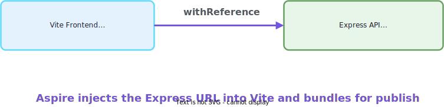
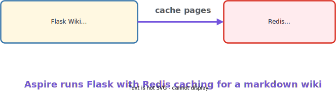
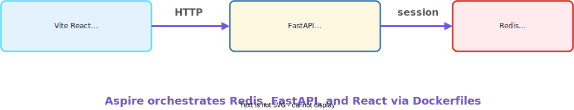
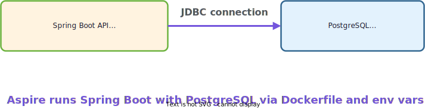
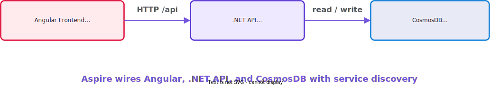

<!-- _footer: 'https://github.com/codebytes/aspire-polyglot' -->
<!-- _class: lead -->

# <!--fit--> Polyglot Aspire

## Orchestrating Any Language with Aspire
## Chris Ayers


---


## Chris Ayers

### Principal Software Engineer<br>Azure EngOps AzRel<br>Microsoft

<i class="fa-brands fa-bluesky"></i> BlueSky: [@chris-ayers.com](https://bsky.app/profile/chris-ayers.com)
<i class="fa-brands fa-linkedin"></i> LinkedIn: - [chris\-l\-ayers](https://linkedin.com/in/chris-l-ayers/)
<i class="fa fa-window-maximize"></i> Blog: [https://chris-ayers\.com/](https://chris-ayers.com/)
<i class="fa-brands fa-github"></i> GitHub: [Codebytes](https://github.com/codebytes)
<i class="fa-brands fa-mastodon"></i> Mastodon: [@Chrisayers@hachyderm.io](https://hachyderm.io/@Chrisayers)

---

# The Polyglot Problem

> Modern apps are a **big city without a map** — and for polyglot teams,
> the streets are in five different languages.

Your team doesn't use one language — it uses **five**.

**Your stack today**
- Python ML services
- Go microservices
- Java Spring Boot APIs
- TypeScript/React frontends
- .NET backend APIs

**The question:** How do you orchestrate, observe, and wire all of this **from one place**?

<!-- We've all been there. The README says "just run docker-compose up" but it never works the first time. Five languages, one app, no map. -->

---

<!-- _class: compact -->

# The Orchestration Pain

**Five stacks. Five toolchains. Zero shared model.**

- 🚢 **Docker Compose** — manual port wiring, no built-in telemetry, no health-aware startup ordering
- 📄 **Config sprawl** — `.env`, YAML, `application.properties`, `appsettings.json` — each language has its own format
- 🔍 **No unified observability** — good luck tracing a request across four services in three runtimes
- 📜 **15-step READMEs** — "just `docker-compose up`" never works first time

<!-- Each language has its own logging, its own config format, its own service discovery pattern. You end up with hardcoded URLs everywhere. -->

---

<!-- _class: gradient -->

# <!--fit--> Aspire: The Polyglot Answer

<p style="color:#ffffff; font-weight:500; max-width:1000px; margin:0.5em auto 0;">Aspire is an agent-ready, code-first tool to compose, debug, and deploy any distributed app.</p>

<!-- Use the official positioning sentence verbatim — it sets up everything that follows. Then transition to the four pillars. -->

---

<!-- _class: compact -->

# The Four Pillars

**These are the four parts of Aspire you'll see today — across every language.**

<div class="columns">
<div>

## 🛠 Aspire CLI
**Your control plane**
`aspire init` · `aspire run` · `aspire deploy` — agent-ready, interactive, the same commands for every stack.

## 🗺 Aspire AppHost
**Your stack in code**
One file declares every service and how they connect — C#, TypeScript, Python, or `aspire.config.json`.

</div>
<div>

## 📊 Aspire Dashboard
**Your app at a glance**
Logs, traces, metrics, and health for every resource — powered by OpenTelemetry, surfaced over an MCP server for agents.

## 🧩 Aspire Integrations
**Building blocks, not black boxes**
**100+** prebuilt packages for databases, caches, queues, AI, and clouds — or bring your own container, CLI, or agent.

</div>
</div>

<!-- The official Spring '26 deck names exactly these four pillars. Every slide in the rest of the talk maps back to one of them — call that out. -->

---

<!-- _class: compact -->

# One Orchestrator for Every Language

**Aspire gives you three things, regardless of language:**

🎯 **Orchestration**
Define your entire stack — Python, Go, Java, TypeScript, .NET — in one AppHost file.

📡 **Service Discovery**
Endpoints and connection strings auto-injected as environment variables.

📊 **Observability**
One dashboard for logs, traces, and metrics across **all** services via OpenTelemetry.

<!-- These three promises map onto the rest of the talk. Each one shows up everywhere. -->

---

<!-- _class: compact code-compact -->

# Your Stack in One File

**One C# AppHost wires Python, React, and .NET — auto-discovery, observability, lifecycle:**

```csharp
var builder = DistributedApplication.CreateBuilder(args);

var redis = builder.AddRedis("cache");
var postgres = builder.AddPostgres("db")
                      .AddDatabase("appdata");

builder.AddUvicornApp("ml-service", "../python", "main:app")
       .WithUv()
       .WithReference(redis);

builder.AddViteApp("frontend", "../react")
       .WithHttpEndpoint(env: "PORT")
       .WithReference(postgres);

builder.AddProject<Projects.Api>("api")
       .WithReference(redis)
       .WithReference(postgres);

builder.Build().Run();
```

<!-- This is the Aspire AppHost — the central brain that starts everything and wires it together. Python, React, .NET, all visible in one dashboard. -->

---

<!-- _class: compact -->

# The Dashboard — One View for Everything

**Same dashboard regardless of what language your services use:**

<div class="columns">
<div>

📋 **Resources** — All services, containers, status, endpoints
📜 **Console Logs** — Real-time stdout/stderr from every process
📊 **Structured Logs** — Parsed JSON logs, filter by level
🔍 **Traces** — Distributed request tracing across services
📈 **Metrics** — Latency, CPU/memory, custom metrics

</div>
<div>


Aspire sets `OTEL_EXPORTER_OTLP_ENDPOINT` automatically — add OpenTelemetry to your service and traces flow to the dashboard.

</div>
</div>

<!-- This is the payoff — show it early. One dashboard for everything, regardless of language. Click a trace to see the full waterfall across Python, .NET, and Node.js. Export as .env for local debugging. -->

---

<!-- _class: compact -->

# Standalone Dashboard — No AppHost Required

### Already on OTEL? Get the dashboard with zero rewrites.

**The Aspire Dashboard ships as a standalone container.** Point any OTLP-emitting app at it and you get logs, traces, and metrics — no AppHost, no .NET, no commitment.

- ✅ **Node.js / Python / Java / Go / Rust** — anything with an OTEL SDK works
- ✅ **Same UI** as the AppHost-managed dashboard
- ✅ **Local-only by default** — OTLP endpoint and dashboard auth keys printed at startup
- ✅ **Use it in CI**, in a Dockerfile, in `docker-compose.yml`, or attached to a Kubernetes pod

```bash
docker run --rm -it -p 18888:18888 -p 4317:18889 \
  -d --name aspire-dashboard \
  mcr.microsoft.com/dotnet/aspire-dashboard:latest
```

Open `http://localhost:18888` — done.

<!-- This closes a real adoption gap for polyglot teams: "I'm not on .NET, can I still use any of this?" Yes — start here. -->

---

<!-- _class: dense code-compact -->

# Wire Any OTEL App in 30 Seconds

**Point your Node.js app at the standalone dashboard:**

```javascript
// otel.js
import { NodeSDK } from "@opentelemetry/sdk-node";
import {
  OTLPTraceExporter
} from "@opentelemetry/exporter-trace-otlp-grpc";

const sdk = new NodeSDK({
  traceExporter: new OTLPTraceExporter({
    url: "http://localhost:4317"
  })
});
sdk.start();
```

**Migration path:** start with the standalone dashboard for observability today; adopt the AppHost later when you want service discovery, integrations, and `aspire deploy`.

<!-- Once they like the UI, the AppHost story becomes a much easier sell. -->

---

<!-- _class: compact code-compact -->

# OpenTelemetry — Python

**Wire OTEL once. Aspire injects `OTEL_EXPORTER_OTLP_ENDPOINT` automatically.**

```python
from opentelemetry import trace
from opentelemetry.exporter.otlp.proto.grpc \
  .trace_exporter import OTLPSpanExporter
from opentelemetry.sdk.trace import TracerProvider
from opentelemetry.sdk.trace.export \
  import BatchSpanProcessor

provider = TracerProvider()
provider.add_span_processor(
  BatchSpanProcessor(OTLPSpanExporter(
    endpoint=os.environ.get(
      'OTEL_EXPORTER_OTLP_ENDPOINT')
  ))
)
trace.set_tracer_provider(provider)
```

**One block of boilerplate** — and your Python service is in the dashboard.

<!-- Add the OTel SDK, point at the env var Aspire injects, and you're done. -->

---

<!-- _class: compact code-compact -->

# OpenTelemetry — Node.js

**Same idea, different runtime — and you get auto-instrumentation for free.**

```javascript
const { NodeSDK } =
  require('@opentelemetry/sdk-node');
const { getNodeAutoInstrumentations } =
  require('@opentelemetry/auto-instrumentations-node');
const { OTLPTraceExporter } =
  require('@opentelemetry/exporter-trace-otlp-grpc');

const sdk = new NodeSDK({
  traceExporter: new OTLPTraceExporter({
    url: process.env.OTEL_EXPORTER_OTLP_ENDPOINT
  }),
  instrumentations: [getNodeAutoInstrumentations()]
});
sdk.start();
```

**Auto-instrumentations** capture Express, Fastify, fetch, pg, redis — without code changes.

<!-- Node gets even better — auto-instrumentations grab HTTP, DB, redis, etc. for free. -->

---

<!-- _class: compact -->

# Architecture Overview

**AppHost orchestrates everything — DCP manages processes, Dashboard collects telemetry**


<!-- The AppHost is the central orchestrator. All services report their telemetry to the unified dashboard. -->

---

<!-- _class: invert -->

# <!--fit--> How It Works

The patterns that make polyglot orchestration possible

<!-- Now let's look at the mechanisms under the hood. -->

---

# Service Discovery

**Aspire injects service endpoints as environment variables:**

```bash
# Pattern: services__<name>__<protocol>__<index>
services__api__http__0=http://localhost:5000
services__frontend__http__0=http://localhost:3000
```

**Read them in any language — same pattern everywhere:**

<div class="columns">
<div>

**Python:**
```python
api_url = os.environ['services__api__http__0']
requests.get(f'{api_url}/data')
```

**Go:**
```go
apiURL := os.Getenv("services__api__http__0")
```

</div>
<div>

**Node.js:**
```javascript
const apiUrl = process.env['services__api__http__0'];
await fetch(`${apiUrl}/data`);
```

**Java:**
```java
String apiUrl = System.getenv("services__api__http__0");
```

</div>
</div>

**No hardcoded URLs. No `.env` files. Aspire wires it.**

<!-- This is the magic. The double underscore __ is used because environment variables can't have colons. Every language can read env vars — that's the universal interface. -->

---

<!-- _class: compact code-compact -->

# Connection Strings — The Pattern

**Infrastructure resources get connection strings as environment variables:**

```bash
# Pattern: CONNECTIONSTRINGS__<resource>
CONNECTIONSTRINGS__cache=localhost:6379
CONNECTIONSTRINGS__db=Host=localhost;Port=5432;Username=postgres;Password=...
CONNECTIONSTRINGS__messaging=localhost:9092
```

**Python — Redis:**
```python
client = redis.from_url(
  f"redis://{os.environ['CONNECTIONSTRINGS__cache']}"
)
```

**Aspire injects the env var** — your service reads it using its language's standard mechanism.

<!-- Aspire handles connection-string complexity so you don't manage .env files. -->

---

<!-- _class: compact code-compact -->

# Same Pattern, Every Language

**Node.js — Kafka:**
```javascript
const kafka = new Kafka({
  brokers: [process.env.CONNECTIONSTRINGS__messaging]
});
```

**Java — PostgreSQL:**
```java
String url = "jdbc:postgresql://"
  + System.getenv("PG_HOST") + ":"
  + System.getenv("PG_PORT") + "/"
  + System.getenv("PG_DB");
```

**Go, Rust, .NET, PowerShell** — same pattern. Aspire sets the env var; your code reads it.

<!-- For C# AppHosts using AddPostgres, connection strings are auto-generated. For polyglot AppHosts, you wire env vars explicitly — same result, more control. -->

---

<!-- _class: compact -->

# Resource Lifecycle Management


**Dependency Order:** Infrastructure → Backend Services → Frontend
**Health Monitoring:** `WithHttpHealthCheck("/health")` — automatic restarts on failure
**Graceful Shutdown:** Clean termination of all processes
**Backed by 100+ integrations** — Postgres, Redis, Kafka, Cosmos, OpenAI, Ollama, and your own containers all participate in the same lifecycle.

<!-- Aspire manages startup ordering automatically based on WithReference and WaitFor dependencies. Infrastructure comes up first, then backends, then frontends. Over 100 integrations are wired to the same lifecycle so health/dependency rules apply to everything in the AppHost. -->

---

<!-- _class: compact code-compact -->

# The AppHost — Your Stack in Code

**Write your AppHost in the language your team knows:**

<div class="columns">
<div>

**C# AppHost**
```csharp
var builder = DistributedApplication
    .CreateBuilder(args);

var redis = builder.AddRedis("cache");

builder.AddPythonApp("api", "../api", "app.py")
       .WithReference(redis)
       .WithHttpEndpoint(env: "PORT");

builder.Build().Run();
```

</div>
<div>

**TypeScript AppHost**
```typescript
const builder = await createBuilder();

const redis = await builder.addRedis("cache");

await builder
  .addPythonApp("api", "../api", "app.py")
  .withReference(redis)
  .withHttpEndpoint({ env: "PORT" });

await builder.build().run();
```

</div>
</div>

**Same 40+ integrations** — Redis, Azure, Kafka, MongoDB, PostgreSQL — available in both C# and TypeScript.

<!-- The TypeScript AppHost uses the same integration packages as C#, auto-generated via [AspireExport] attributes. A JS/TS team never needs to touch .NET. -->

---

<!-- _class: dense code-compact -->

# Two AppHost Languages

**Author your AppHost in C# or TypeScript today — both officially supported.**

<div class="columns">
<div>

💜 **C# (.NET)** — `AppHost.cs`
```csharp
var builder = DistributedApplication
    .CreateBuilder(args);

builder.AddProject<Projects.Api>("api")
       .WithHttpEndpoint(env: "PORT");

builder.Build().Run();
```
Best fit: teams already on .NET tooling.

</div>
<div>

🟦 **TypeScript** — `apphost.ts`
```typescript
const builder = await createBuilder();

await builder
  .addJavaScriptApp("api", "./src")
  .withHttpEndpoint({ env: "PORT" });

await builder.build().run();
```
Best fit: Node.js / TypeScript workspaces.

</div>
</div>

**Same model, different syntax.** Both produce the same dashboard, service discovery, health checks, and deployment artifacts.

<!-- Per aspire.dev/languages-and-runtimes: only C# and TypeScript are documented AppHost authoring languages today. -->

---

<!-- _class: compact -->

# Workloads Can Be Anything

**Pick the AppHost language that fits your repo. Your services don't need to match.**

The TypeScript SDK is auto-generated from the same .NET hosting integrations via the **Aspire Type System (ATS)** — there's no separate integration surface to maintain.

**Workloads inside the AppHost** can be written in:

- C#, JavaScript, TypeScript, Python, Go, Java, Rust, PowerShell, and more

via `AddProject`, `AddJavaScriptApp`, `AddPythonApp`, `AddDockerfile`, `AddContainer`, or `AddExecutable`.

<!-- AppHost authoring is C#/TS today; workload language support is separate and much broader. -->

---

<!-- _class: dense code-compact -->

# Write Once with ATS

### Author the integration in C#. Use it from any AppHost.

**Aspire Type System (ATS)** — the contract that bridges .NET and guest languages.

- Author your hosting integration **in C#** as you always have
- Annotate exported APIs with ATS attributes — `[AspireExport]`, `[AspireExportType]`, `[AspireExportMethod]`
- Aspire's analyzer validates the export shape at build time

```csharp
[AspireExport]
public static class MyIntegrationExtensions
{
    [AspireExportMethod]
    public static IResourceBuilder<MyResource>
        AddMyService(
            this IDistributedApplicationBuilder builder,
            string name) { ... }
}
```

<!-- Integration authors don't write a TS binding by hand — the analyzer + ATS scanner generates it. -->

---

<!-- _class: dense code-compact -->

# Use From TypeScript — Zero Bindings

**The CLI auto-generates a TypeScript SDK** into `.modules/` when a TS AppHost runs `aspire add <your-package>`. TypeScript callers get fluent, typed methods.

```typescript
import { createBuilder } from "./.modules/aspire.js";
import { addMyService } from
    "./.modules/my-integration.js";

const builder = await createBuilder();
const svc = await addMyService(builder, "svc");
```

**The trade-off:** the guest process talks to the .NET host over a local JSON-RPC socket (Unix socket / named pipe), authenticated with a per-session token. One IPC hop, no port exposure, no duplicated integration code per language.

*Status: preview feature in 13.x.*

<!-- That's how 100+ .NET integrations show up automatically in TypeScript AppHosts. -->

---

<!-- _class: compact code-compact -->

# Aspire Polyglot Cheat Sheet

<div class="columns">
<div>

**Runtime → Method (C# SDK)**
- Python / ASGI → `AddPythonApp()`
- Python / Uvicorn → `AddUvicornApp()`
- Node.js → `AddNodeApp()`
- Vite / React → `AddViteApp()`
- .NET project → `AddProject<T>()`
- JavaScript → `AddJavaScriptApp()`
- Any Dockerfile → `AddDockerfile()`
- Go → `AddGolangApp()` (Community Toolkit)
- Java / Spring Boot → `AddSpringApp()` (Community Toolkit)
- Any executable → `AddExecutable()`

</div>
<div>

**Common Patterns**
```csharp
.WithReference(redis)
.WaitFor(postgres)
.WithHttpEndpoint(env: "PORT")
.WithExternalHttpEndpoints()
.WithUv()
.WithNpm()
.WithBun()
.WithBuildSecret("key", secret)
.WithRunScript("dev")
.WithHttpHealthCheck("/health")
.WithMcpServer("mcp")
```

</div>
</div>

**Infrastructure:** `AddRedis("name")` · `AddPostgres("name").AddDatabase("db")` · `AddKafka("name")` · `AddAzureCosmosDB("name").RunAsEmulator()`

<!-- Keep this slide handy as a quick reference for everything we just covered! -->

---

<!-- _class: dense code-compact -->

# `aspire.config.json` — One Config for Every Language

**This file tells the CLI which language your AppHost uses.**

<div class="columns">
<div>

```json
{
  "appHost": {
    "path": "apphost.py",
    "language": "python"
  },
  "sdk": { "version": "13.2.0" },
  "channel": "stable",
  "features": {
    "polyglotSupportEnabled": true
  },
  "profiles": {
    "default": {
      "applicationUrl": "https://localhost:17000"
    }
  }
}
```

</div>
<div>

**What it does:**
- `appHost.path` + `appHost.language` — declares your stack
- `sdk.version` — pins the Aspire SDK version
- `channel` — release channel (`stable`, `preview`)
- `profiles` — dashboard URLs (replaces `apphost.run.json`)
- Feature flags use **boolean `true`** (not string `"true"`)

</div>
</div>

<!-- Drop aspire.config.json in your project root, point it at your AppHost file, set the language, and aspire run just works. -->

---

<!-- _class: compact code-compact -->

# Manage Config From the CLI

**No manual JSON editing required:**

```bash
# Read & write config values
aspire config list
aspire config get <key>
aspire config set <key> <value>

# Manage secrets (encrypted at rest)
aspire secret set <key> <value>
aspire secret list / get / delete

# Local dev certs
aspire certs clean
aspire certs trust
```

**Every sample in this talk** has an `aspire.config.json` at its root — peek inside.

<!-- The CLI is the friendlier surface — most teams never edit aspire.config.json directly. -->

---

<!-- _class: compact code-compact -->

# Getting Started

**No .NET SDK required** — [get.aspire.dev](http://get.aspire.dev)

<div class="columns">
<div>

**Install & scaffold**
```bash
curl -sSL https://aspire.dev/install.sh | bash
aspire new aspire-py-starter -n my-app
aspire new aspire-ts-starter -n my-app
aspire new aspire-starter -n my-app
cd my-app && aspire run
```

</div>
<div>

**Day-to-day commands**
```bash
aspire run / aspire start    # Run / background
aspire ps / aspire stop      # List / stop
aspire describe --follow     # Watch resources
aspire doctor                # Environment check
aspire otel / aspire logs    # Telemetry & logs
aspire export                # Capture to zip
```

</div>
</div>

<!-- aspire doctor is great before a talk. aspire start runs in detached mode. aspire new is language-aware — it scaffolds the right AppHost structure for your chosen language. -->

---

<!-- _class: compact -->

# Agent-Ready CLI

### Two MCP servers. One model. Any agent.

**MCP support out of the box — no plugins, no glue.**

- 🛠 **CLI MCP** — stdio. Agent spawns `aspire agent mcp` as a subprocess. Set up by `aspire agent init`.
- 📊 **Dashboard MCP** — streamable HTTP + API key. Click the **MCP** button in the dashboard top-right.
- 🧠 **Tools agents get**: `list_resources`, `list_console_logs`, `list_traces`, `execute_resource_command`, `search_docs`, `doctor`.
- 🔌 **Clients**: VS Code, Claude Code, Copilot CLI, OpenCode — any MCP-aware client works.

**Polyglot bonus:** the agent sees Python tracebacks, Go panics, Java stack traces, and Node errors through the same OTEL pipeline.

<!-- Per aspire.dev/get-started/aspire-mcp-server/. CLI MCP = stdio + `aspire agent init`. Dashboard MCP = streamable HTTP + API key from the dashboard UI. -->

---

<!-- _class: dense code-compact -->

# Wire It Up in 30 Seconds

**One-time setup, then any MCP-aware agent works:**

```bash
# 1. One-time setup in your AppHost dir
$ aspire agent init
  ◻ Aspire skill file       (recommended)
  ◻ Aspire MCP server
  ◻ Playwright CLI

# 2. Start your stack, open your agent
$ aspire run
$ claude    # reads .mcp.json
$ code .    # reads .vscode/mcp.json
```

```jsonc
// .vscode/mcp.json (auto-generated)
{ "servers": { "aspire": {
    "type": "stdio",
    "command": "aspire",
    "args": ["agent", "mcp"]
} } }
```

<!-- Earlier drafts invented an `http://localhost:15889/mcp` URL — doesn't exist for the CLI server. -->

---

<!-- _class: purple -->

# <!--fit--> Demos

8 samples — live with the Aspire dashboard

<!-- Time to see Aspire in action! -->

---

<!-- _class: compact -->

# 8 Live Demos

<div class="columns">
<div>

**Simple → Full-stack**
1. **ts-starter** — Express + React (TS AppHost)
2. **flask-markdown-wiki** — Flask + Redis (Python AppHost)
3. **vite-react-api** — FastAPI + React + Redis (TS AppHost)
4. **django-htmx-polls** — Django + HTMX + PostgreSQL (Python AppHost)

</div>
<div>

**Multi-runtime → Polyglot**
5. **spring-boot-postgres** — Spring Boot + PostgreSQL (Java AppHost)
6. **svelte-go-bookmarks** — Go API + Svelte + PostgreSQL (Go AppHost)
7. **dotnet-angular-cosmos** — Angular + .NET + CosmosDB (C# AppHost)
8. **polyglot-event-stream** — .NET + Python + Node.js + Kafka (C# AppHost)

</div>
</div>

<!-- Ordered by escalating complexity — same orchestration model, increasing sophistication. -->

---

<!-- _class: compact -->

# Demo: TypeScript Starter

**TypeScript AppHost** → Express API + React Frontend



<!-- The simplest polyglot demo. TypeScript AppHost with auto-wired API and frontend. -->

---

<!-- _class: compact -->

# Demo: Flask Markdown Wiki

**Python AppHost** → Flask Wiki App + Redis Cache



<!-- Python orchestrating Python — the AppHost and the service are both Python. -->

---

<!-- _class: compact -->

# Demo: Vite React + FastAPI

**TypeScript AppHost** → React Frontend + Python FastAPI + Redis



<!-- Full-stack TypeScript-orchestrated app with Python backend and Redis caching. -->

---

<!-- _class: compact -->

# Demo: Django HTMX Polls

**Python AppHost** → Django + HTMX + PostgreSQL


<!-- Real-time voting with HTMX partial updates, Django backend, PostgreSQL persistence. -->

---

<!-- _class: compact -->

# Demo: Spring Boot Notes

**Java AppHost** → Spring Boot API + PostgreSQL



<!-- Java orchestrating Java — experimental Java AppHost with Spring Boot and PostgreSQL. -->

---

<!-- _class: compact -->

# Demo: Svelte + Go Bookmarks

**Go AppHost** → Go REST API + Svelte Frontend + PostgreSQL


<!-- Go orchestrating a full-stack app — Go API backend with Svelte frontend. -->

---

<!-- _class: compact -->

# Demo: Angular + .NET + CosmosDB

**C# AppHost** → Angular Frontend + .NET API + Azure CosmosDB



<!-- Classic .NET AppHost orchestrating Angular frontend with CosmosDB emulator. -->

---

<!-- _class: compact -->

# Demo: Polyglot Event Stream

**C# AppHost** → .NET Producer + Python Consumer + Node.js Dashboard + Kafka


<!-- The ultimate polyglot demo — three languages, one event pipeline, full distributed tracing. -->

---

<!-- _class: compact code-compact -->

# Same Model, Two Commands

**One AppHost. Local, staging, production.**

```bash
aspire run       # Local development
aspire deploy    # Deploy to target  (Preview)
aspire publish   # Generate artifacts (Preview)
aspire do        # Pipeline step      (Preview)
```

**What Aspire generates from your AppHost:**

- 🐳 Container images for **all languages**
- ☸️ Azure Container Apps / Kubernetes manifests
- 🔌 Infrastructure wiring (Redis, Postgres, Kafka…)
- 🔗 Service connections + environment variables

**No separate deploy config.** The AppHost is the contract.

<!-- This works whether your services are Python, Go, Java, TypeScript, .NET — you don't need per-language deploy plumbing. -->

---

<!-- _class: compact code-compact -->

# What That Looks Like

<div class="columns">
<div>

**`aspire run` (local)**
```text
✅ redis (cache)         healthy   :6379
✅ postgres (db)         healthy   :5432
✅ ml-service (python)   running   :8000
✅ frontend (vite)       running   :5173
✅ api (.net)            running   :8080

Dashboard: http://localhost:15888
```

</div>
<div>

**`aspire deploy` (target)**
```text
→ Building images for python, node, .net
→ Pushing to acrcdbytes.azurecr.io
→ Provisioning Container Apps environment
→ Wiring Postgres + Redis connection strings
✅ Deployed to dev environment in 4m 12s
```

</div>
</div>

**Same code-first AppHost drives both.**

<!-- The pivot: aspire run → aspire deploy. Same model, no extra plumbing. -->

---

<!-- _class: gradient -->

# <!--fit--> Wrap-Up

---

# Key Takeaways

<br>

🎯 **One orchestrator for every language** — Define your entire stack in one AppHost file, regardless of runtime

<br>

📊 **Unified observability out of the box** — One dashboard for logs, traces, and metrics across all services via OpenTelemetry

<br>

🚀 **From local dev to production** — Same model, same CLI, same config — `aspire run` to `aspire deploy`

<!-- If your team uses multiple languages, Aspire gives you a single place to define, run, observe, and deploy your entire stack. -->

---

# Resources

<div class="columns">
<div>

## Links

- 🌐 [aspire.dev](https://aspire.dev) — Official website & docs
- 🐙 [github.com/dotnet/aspire](https://github.com/dotnet/aspire) — Source code
- 🐙 [github.com/codebytes/aspire-polyglot](https://github.com/codebytes/aspire-polyglot) — This repo!
- 🛒 [github.com/dotnet/eShop](https://github.com/dotnet/eShop) — eShop sample
- 🧰 [Aspire Community Toolkit](https://github.com/CommunityToolkit/Aspire)
- 💬 [Discord: Aspire channel](https://aka.ms/dotnet-discord)

</div>
<div>

## Follow Chris Ayers


</div>
</div>

---

# Questions?


