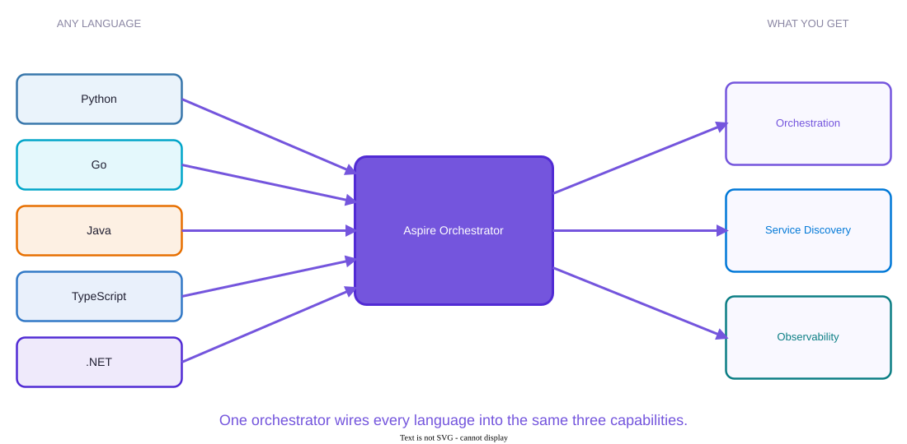
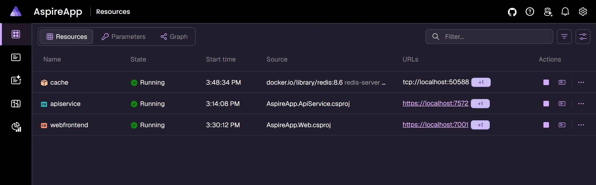
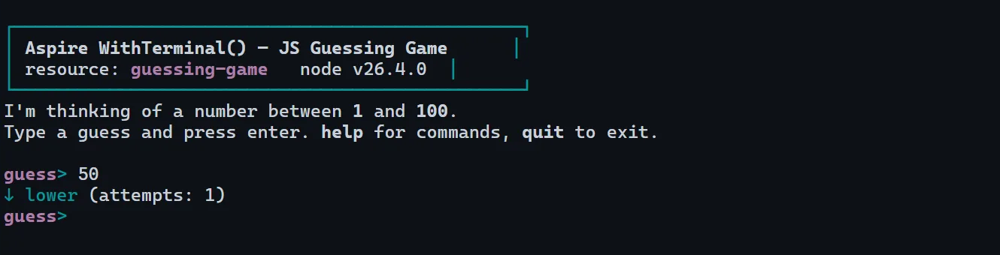
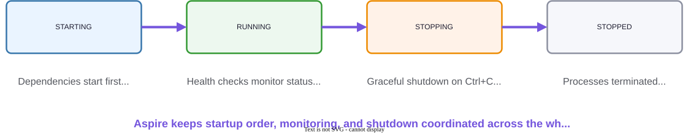
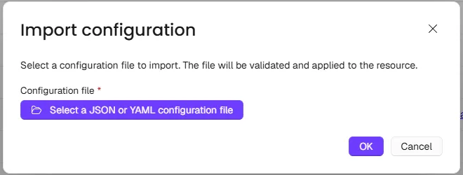

<!-- _footer: 'https://github.com/codebytes/aspire-polyglot' -->
<!-- _class: lead -->

# Polyglot Aspire

## Orchestrating Any Language with Aspire
## Chris Ayers

---


## Chris Ayers

### Principal Software Engineer<br>Azure EngOps AzRel<br>Microsoft

<i class="fa-brands fa-bluesky"></i> BlueSky: [@chris-ayers.com](https://bsky.app/profile/chris-ayers.com)
<i class="fa-brands fa-linkedin"></i> LinkedIn: - [chris\-l\-ayers](https://linkedin.com/in/chris-l-ayers/)
<i class="fa fa-window-maximize"></i> Blog: [https://chris-ayers\.com/](https://chris-ayers.com/)
<i class="fa-brands fa-github"></i> GitHub: [Codebytes](https://github.com/codebytes)
<i class="fa-brands fa-mastodon"></i> Mastodon: [@Chrisayers@hachyderm.io](https://hachyderm.io/@Chrisayers)

---

# The Polyglot Problem

> Modern apps are an **orchestra with no conductor**, and for polyglot teams,
> every section is reading from a different score.

Your team doesn't use one language. It uses **five**.

**Your stack today**
- Python ML services
- Go microservices
- Java Spring Boot APIs
- TypeScript/React frontends
- .NET backend APIs

**The question:** How do you orchestrate, observe, and wire all of this **from one place**?

<!-- We've all been there. The README says "just run docker-compose up" but it never works the first time. Five languages, one app, no map. -->

---

<!-- _class: compact -->

# The Orchestration Pain

**Five stacks. Five toolchains. Zero shared model.**

- 🚢 **Docker Compose**: manual port wiring, no built-in telemetry, no health-aware startup ordering
- 📄 **Config sprawl**: `.env`, YAML, `application.properties`, `appsettings.json`, each with its own format
- 🔍 **No unified observability**: good luck tracing a request across four services in three runtimes
- 📜 **15-step READMEs**: "just `docker-compose up`" never works first time

<!-- Each language has its own logging, its own config format, its own service discovery pattern. You end up with hardcoded URLs everywhere. -->

---

<!-- _class: gradient -->

# <!--fit--> Aspire: The Polyglot Answer

<p style="color:#ffffff; font-weight:500; max-width:1000px; margin:0.5em auto 0;">Aspire is an agent-ready, code-first tool to compose, debug, and deploy any distributed app.</p>

<!-- Use the official positioning sentence verbatim. It sets up everything that follows. Then transition to the four pillars. -->

---

<!-- _class: compact -->

# What Collapses Into One

**One `aspire run` replaces five separate startup commands:**

<div class="chart">
<div class="hbars">
<div class="metric"><div class="name">Startup commands</div><div class="group"><div class="bar before" style="width:100%">5</div><div class="bar after" style="width:20%">1</div></div></div>
<div class="metric"><div class="name">Config formats</div><div class="group"><div class="bar before" style="width:80%">4</div><div class="bar after" style="width:20%">1</div></div></div>
<div class="metric"><div class="name">Observability panes</div><div class="group"><div class="bar before" style="width:60%">3</div><div class="bar after" style="width:20%">1</div></div></div>
</div>
<div class="legend"><span class="key k-before">Without Aspire</span><span class="key k-after">With Aspire</span></div>
</div>

<!-- The language toolchains stay in place: you still have Python, Node, and .NET. Aspire orchestrates them behind one command. Config formats: .env, YAML, application.properties, appsettings.json. Observability panes: logs, traces, metrics, normally three separate tools. Aspire folds all of it into one model and one dashboard. -->

---

<!-- _class: compact -->

# The Four Pillars

<div class="pillars">
<div class="entablature">Polyglot Aspire</div>
<div class="architrave"></div>
<div class="cols">

<div class="pillar p1">
<div class="cap"></div>
<div class="shaft">
<div class="icon">🛠</div>
<div class="pname">Aspire CLI</div>
<div class="ptag">Control plane</div>
<div class="pdesc">One command set for every stack: <code>init</code>, <code>run</code>, <code>deploy</code>. Agent-ready and interactive.</div>
</div>
<div class="base"></div>
</div>

<div class="pillar p2">
<div class="cap"></div>
<div class="shaft">
<div class="icon">🗺</div>
<div class="pname">Aspire AppHost</div>
<div class="ptag">Stack in code</div>
<div class="pdesc">One AppHost declares every service and how they connect. Author it in C# or TypeScript.</div>
</div>
<div class="base"></div>
</div>

<div class="pillar p3">
<div class="cap"></div>
<div class="shaft">
<div class="icon">📊</div>
<div class="pname">Aspire Dashboard</div>
<div class="ptag">App at a glance</div>
<div class="pdesc">Logs, traces, metrics, and health across runtimes. Interact with terminal-enabled resources.</div>
</div>
<div class="base"></div>
</div>

<div class="pillar p4">
<div class="cap"></div>
<div class="shaft">
<div class="icon">🧩</div>
<div class="pname">Aspire Integrations</div>
<div class="ptag">Building blocks</div>
<div class="pdesc"><strong>100+</strong> prebuilt packages for data, caches, queues, AI, and clouds. Or bring your own.</div>
</div>
<div class="base"></div>
</div>

</div>
</div>

<!-- Four pillars hold up the whole model: the CLI drives it, the AppHost declares it, the Dashboard shows it, and Integrations plug into it. Same four regardless of language. -->

---

<!-- _class: compact -->

# One Orchestrator for Every Language



<!-- Five languages funnel into one orchestrator, and out come the same three capabilities: orchestration, service discovery, and observability. Each one maps onto the rest of the talk. -->

---

# Your Stack in One File

**One C# AppHost wires Python, React, and .NET with auto-discovery, observability, and lifecycle:**

<div class="columns">
<div>

```csharp
var builder = DistributedApplication.CreateBuilder(args);

var redis = builder.AddRedis("cache");
var postgres = builder.AddPostgres("db")
                      .AddDatabase("appdata");

builder.AddUvicornApp("ml-service", "../python", "main:app")
       .WithUv()
       .WithReference(redis);

```

</div>
<div>

```
builder.AddViteApp("frontend", "../react")
       .WithHttpEndpoint(env: "PORT")
       .WithReference(postgres);

builder.AddProject<Projects.Api>("api")
       .WithReference(redis)
       .WithReference(postgres);

builder.Build().Run();
```

</div>
</div>

<!-- This is the Aspire AppHost, the central brain that starts everything and wires it together. Python, React, .NET, all visible in one dashboard. -->

---

<!-- _class: compact release-slide dashboard-slide -->

# The Dashboard: One View for Everything

<figure class="release-screenshot">

<figcaption>Source: <a href="https://aspire.dev/whats-new/aspire-13-5/">Microsoft Aspire 13.5 release notes</a></figcaption>
</figure>

**13.5:** Case-insensitive console search, timestamp filters, and numeric `==` / `!=` comparisons.

Add OpenTelemetry to your services; Aspire supplies `OTEL_EXPORTER_OTLP_ENDPOINT`.

<!--
Show the dashboard early: resources expose state, endpoints, and actions; console logs capture stdout/stderr; structured logs, traces, and metrics come through OpenTelemetry.
In 13.5, demonstrate a case-insensitive console-log search, then narrow logs or traces by timestamp and exact numeric comparisons.
Screenshot is the official release-note example, not a capture of this repository's demos.
Source: https://aspire.dev/whats-new/aspire-13-5/
Image: https://aspire.dev/_astro/projects.DUzpqXcM_Z1aIiSQ.webp
-->

---

<!-- _class: compact release-slide terminal-slide -->

# Not Everything Is an HTTP Service

**Experimental in 13.5:** REPLs, shells, and TUIs are resources too.

<figure class="release-screenshot">

<figcaption>Cropped from the <a href="https://devblogs.microsoft.com/aspire/whats-new-aspire-13-5/">Microsoft Aspire 13.5 announcement</a></figcaption>
</figure>

<div class="columns">
<div>

Enable C# `.WithTerminal()` or TypeScript `.withTerminal()` on a resource.

**Real input and output. One session, multiple viewers.**

</div>
<div>

```bash
aspire config set features.terminalCommandsEnabled true
aspire terminal ps
aspire terminal attach guessing-game
```

</div>
</div>

<!--
The screenshot shows Microsoft's JavaScript guessing-game playground, not an extra demo in this repository. If showing it live, enter 50, read the response, then attach from the CLI to show the same session in both places. Replace guessing-game with the name of your terminal-enabled resource.
WithTerminal() and the terminal CLI are experimental in 13.5. C# callers must suppress ASPIRETERMINAL001. The feature flag enables the CLI commands; it is not required to use the dashboard terminal.
Terminal-enabled resources run as plain processes and do not get automatic debugger attachment. Attach the debugger manually from your IDE when needed.
Sources: https://aspire.dev/app-host/with-terminal/ and https://aspire.dev/reference/cli/commands/aspire-terminal/
Image: https://devblogs.microsoft.com/aspire/wp-content/uploads/sites/90/2026/08/aspire-terminal-guessing-game.webp (cropped to the interactive content).
-->

---

# Observability Without Rewrites

**Already emitting OpenTelemetry? Start with the dashboard, then adopt the AppHost when you need orchestration.**

<div class="columns">
<div>

**Standalone mode**
```bash
docker run --rm -d \
  -p 18888:18888 -p 4317:18889 \
  mcr.microsoft.com/dotnet/aspire-dashboard:latest
```

</div>
<div>

**AppHost mode**

Aspire injects `OTEL_EXPORTER_OTLP_ENDPOINT` automatically. The same dashboard adds service discovery, integrations, health, and lifecycle.

</div>
</div>

**No .NET requirement:** Node.js, Python, Java, Go, and Rust services can all send OTLP to the same dashboard.

<!-- Keep this as the adoption bridge: observability first, orchestration when the team is ready. -->

---

<!-- _class: compact -->

# Architecture Overview

**AppHost orchestrates everything: DCP manages processes, Dashboard collects telemetry**


<!-- The AppHost is the central orchestrator. All services report their telemetry to the unified dashboard. -->

---

<!-- _class: invert -->

# <!--fit--> How It Works

The patterns that make polyglot orchestration possible

<!-- Now let's look at the mechanisms under the hood. -->

---

# Service Discovery: The Pattern

**Aspire injects service endpoints as environment variables:**

```bash
# Pattern: services__<name>__<protocol>__<index>
services__api__http__0=http://localhost:5000
services__frontend__http__0=http://localhost:3000
```

**Why double underscore?** Env vars can't have colons, so `__` stands in for the path separator. Every language can read env vars; that's the universal interface.

**No hardcoded URLs. No `.env` files. Aspire wires it.**

<!-- This is the magic. The double underscore __ is used because environment variables can't have colons. -->

---

# Connection Strings: The Pattern

**Infrastructure resources get connection strings as environment variables:**

```bash
# Pattern: CONNECTIONSTRINGS__<resource>
CONNECTIONSTRINGS__cache=localhost:6379
CONNECTIONSTRINGS__db=Host=localhost;Port=5432;Username=postgres;Password=...
CONNECTIONSTRINGS__messaging=localhost:9092
```

**Python + Redis:**
```python
client = redis.from_url(
  f"redis://{os.environ['CONNECTIONSTRINGS__cache']}"
)
```

**Aspire injects the env var.** Python, Node.js, Go, Java, Rust, .NET, and PowerShell read it with their standard environment APIs.

<!-- Service discovery and connection strings share one universal interface: environment variables. -->

---

<!-- _class: compact -->

# Resource Lifecycle Management

<div class="lifecycle-visual">

</div>

<div class="lifecycle-caption">Aspire keeps startup order, monitoring, and shutdown coordinated across the whole app.</div>

**Startup Gating:** `WaitFor(...)` holds dependents until a resource is ready
**Health Monitoring:** `WithHttpHealthCheck("/health")` reports readiness and status
**Graceful Shutdown:** Clean termination of all processes
**Backed by 100+ integrations**: Postgres, Redis, Kafka, Cosmos, OpenAI, Ollama, and your own containers all participate in the same lifecycle.

<!--
WithReference wires configuration; it does not itself impose startup ordering. Use WaitFor to gate a dependent resource on its dependency's readiness. With a registered health check, WaitFor waits for healthy; without one, it waits for the Running state.
WithHttpHealthCheck reports readiness and dashboard status. It does not by itself promise automatic restarts on failure. Production liveness probes and restart policies belong to the deployment orchestrator.
Source: https://aspire.dev/fundamentals/health-checks/
-->

---

# The AppHost: C#

**Write your AppHost in the language your team knows. Here's C#:**

```csharp
var builder = DistributedApplication
    .CreateBuilder(args);

var redis = builder.AddRedis("cache");

builder.AddPythonApp("api", "../api", "app.py")
       .WithReference(redis)
       .WithHttpEndpoint(env: "PORT");

builder.Build().Run();
```

**100+ integrations** like Redis, Azure, Kafka, MongoDB, and PostgreSQL are available out of the box.

<!-- C# is the original AppHost language. Most existing samples use this. -->

---

# The AppHost: TypeScript

**Generally available in 13.5. Same model, TypeScript syntax.**

```typescript
import { createBuilder } from "./.aspire/modules/aspire.mjs";

const builder = await createBuilder();

const redis = await builder.addRedis("cache");

await builder
  .addPythonApp("api", "../api", "app.py")
  .withReference(redis)
  .withHttpEndpoint({ env: "PORT" });

await builder.build().run();
```

**Same integration model via ATS.** 13.5 adds custom health-check callbacks and container file copying.

<!--
TypeScript AppHosts are GA in 13.5; ASPIREATS001 is no longer required. This does not make every experimental AppHost authoring language GA: keep Python, Go, and Java preview labels separate from workload support.
Custom checks use builder.addHealthCheck(name, check) and resource.withHealthCheck(key). withContainerFiles and withContainerFilesCallback copy or generate container files. Keep these as examples of parity, not another API walkthrough.
Current entry points use apphost.mts. aspire update --migrate can migrate older apphost.ts projects; no project migration is part of these slide changes.
Source: https://aspire.dev/whats-new/aspire-13-5/
-->

---

<!-- _class: compact -->

# Workloads Can Be Anything

**Pick the AppHost language that fits your repo. Your services don't need to match.**

The TypeScript SDK is auto-generated from the same .NET hosting integrations via the **Aspire Type System (ATS)**. There's no separate integration surface to maintain.

**Workloads inside the AppHost** can be written in:

- C#, JavaScript, TypeScript, Python, Go, Java, Rust, PowerShell, and more

via `AddProject`, `AddJavaScriptApp`, `AddPythonApp`, `AddGoApp`, `AddBunApp`, `AddDenoApp`, `AddDockerfile`, `AddContainer`, or `AddExecutable`.

<!-- AppHost authoring is C#/TS today; workload language support is separate and much broader. -->

---


<!-- _class: compact -->

# Two Layers Make Polyglot Work: ATS + DCP

<div class="columns">
<div>

## 🧬 ATS — the model layer

**Aspire Type System.** Projects the *same* 100+ .NET hosting integrations into every AppHost language.

- Author the app model **once**, in C#/TS (Python·Go·Java preview)
- CLI auto-generates a typed SDK into `.aspire/modules/`
- Guest AppHost ↔ .NET host over a local JSON-RPC socket (named pipe / Unix socket)
- No per-language bindings to maintain

*"Describe the distributed app."*

</div>
<div>

## ⚙️ DCP — the runtime layer

**Developer Control Plane.** A Kubernetes-compatible, Go-based orchestrator that runs the model.

- AppHost **lowers** the model → DCP resource specs (CRDs)
- Pulls images, starts containers · executables · projects
- Allocates ports, wires service discovery + health checks
- Drives resource lifecycle & state → the dashboard
- **Dev-time only** — not a production runtime

*"Make the distributed app real."*

</div>
</div>

**AppHost = your desired state → ATS carries it in any language → DCP reconciles it into running resources.**

<!-- ATS is the authoring/model layer that makes one set of .NET integrations usable from any AppHost language over JSON-RPC. DCP (Microsoft Developer Control Plane) is the runtime engine — a K8s-compatible API server + controller (dcp.exe / dcpctrl.exe) written in Go — that the AppHost delegates to. The AppHost declares desired state; DCP reconciles it (eventual consistency, retries) into real containers/processes, assigns ports, resolves dependencies, and streams logs/state to the dashboard. Together they're why five languages run under one orchestrator. -->

---

<!-- _class: compact -->

# Runtimes

**Pick the right `Add*` for your service:**

- Python / ASGI · Uvicorn → `AddPythonApp()` · `AddUvicornApp()`
- Node.js · Vite → `AddNodeApp()` · `AddViteApp()`
- JavaScript · Bun → `AddJavaScriptApp()` · `AddBunApp()` *(Bun core in 13.4)*
- Deno → `AddDenoApp()` · `AddDenoTask()` *(Community Toolkit)*
- .NET project · Blazor WASM → `AddProject<T>()` · `AddBlazorWasmProject()`
- Go → `AddGoApp()` *(graduated to core in 13.4)*
- Java / Spring Boot → `AddSpringApp()` *(Community Toolkit)*
- Any Dockerfile · executable → `AddDockerfile()` · `AddExecutable()`

**Infrastructure:** `AddRedis("name")` · `AddPostgres("name").AddDatabase("db")` · `AddKafka("name")` · `AddAzureCosmosDB("name").RunAsEmulator()`

<!-- Quick reference for the runtime side. In 13.4, Go (Aspire.Hosting.Go) and Bun (Aspire.Hosting.JavaScript) graduated from the Community Toolkit into core; Deno and Spring remain Community Toolkit; Blazor WebAssembly hosting is a 13.4 preview. -->

---

<!-- _class: compact code-reference -->

# Common Patterns

**Chainable methods you'll use everywhere:**

```csharp
.WithReference(redis)           // pass connection info
.WaitFor(postgres)              // wait for readiness
.WithHttpEndpoint(env: "PORT")   // expose HTTP
.WithExternalHttpEndpoints()    // public ingress
.WithUv()                       // Python package manager
.WithNpm()                      // JavaScript package manager
.WithHttpHealthCheck("/health") // readiness probe
.WithMcpServer("mcp")            // resource's MCP tools
```

<!-- Keep this slide handy. WithMcpServer describes a resource's own MCP endpoint; it is separate from the Aspire CLI's runtime MCP server. WithReference supplies configuration and WaitFor supplies startup gating. -->

---

<!-- _class: invert -->

# Practical Setup

Repeatable workflows. Familiar tools. Agents with live context.

<!-- Keep this section about the developer's workflow, not the structure of aspire.config.json. -->

---

<!-- _class: compact release-slide -->

# Turn README Steps into Resource Commands

**Define a workflow once. Use it from the dashboard or CLI.**

<div class="columns">
<div>

**Named arguments** become dashboard inputs and CLI options.

Example after registering a custom `seed` command:

```bash
aspire resource api seed --help
aspire resource api seed --count 100
```

**Import files** with a picker, type filters, and size limits.

</div>
<div>

<figure class="release-screenshot">

<figcaption>Cropped from the <a href="https://devblogs.microsoft.com/aspire/whats-new-aspire-13-5/">Microsoft Aspire 13.5 announcement</a></figcaption>
</figure>

**Stable in 13.5:** Command arguments, core prompts, and file inputs.

**Experimental:** Progress dialogs with optional cancellation.

</div>
</div>

<!--
Connect this to the 15-step README problem: an integration author can make import, seed, or reset actions part of the resource model.
The seed command is illustrative, not a built-in Aspire command or an implemented command in these samples. It assumes an api resource with a custom seed command and a count argument.
Declare CommandOptions.Arguments and read ExecuteCommandContext.Arguments; TypeScript has the corresponding ATS exports. The dashboard collects inputs, while the CLI accepts named options and reports missing required values. If an argument collides with an Aspire option, separate command options with --.
File inputs support allowed types and maximum size; the AppHost reads the uploaded content as a stream. Core prompts, command arguments, and file input are stable. Progress dialogs remain experimental (ASPIREINTERACTION001) and are a dashboard interaction, not a prerequisite for a CLI command.
Sources: https://aspire.dev/fundamentals/custom-resource-commands/ and https://aspire.dev/reference/cli/commands/aspire-resource/ and https://aspire.dev/whats-new/aspire-13-5/
Image: https://devblogs.microsoft.com/aspire/wp-content/uploads/sites/90/2026/08/interaction-file-upload.webp (cropped to the file picker).
-->

---

<!-- _class: code-reference -->

# Getting Started

**Install with a familiar package manager:** [get.aspire.dev](https://get.aspire.dev)

<div class="columns">
<div>

**Install & scaffold**
```bash
npm install -g @microsoft/aspire-cli
aspire new aspire-ts-starter -n my-app
cd my-app
aspire run
```

</div>
<div>

**Day-to-day commands**
```bash
aspire start     # Background
aspire ps        # AppHost summaries
aspire describe  # Resource details
aspire doctor    # Environment
aspire logs      # Console output
aspire stop      # Stop the app
```

</div>
</div>

<!--
npm is convenient for Node/TypeScript teams; Homebrew, WinGet, mise, Nix, NuGet, and the install script are also supported. Package-manager distribution started in the 13.4 timeframe; do not present every installation option as new in 13.5. Keep the workload's own toolchain installed.
For C# use aspire-starter; aspire-py-starter is an experimental Python AppHost path. The slide uses just one scaffold command so it is a coherent sequence, not three conflicting project creations.
In 13.5, aspire ps summarizes AppHosts; use aspire describe for resource-level details. The old aspire ps --resources and --include-hidden options were removed.
Before the talk, run aspire doctor. In VS Code the dashboard no longer auto-opens by default: open it explicitly, or opt in with Aspire: Dashboard Browser / dashboardBrowser in launch.json.
Use ordinary aspire stop during the demo. aspire stop --force permanently deletes persistent resource data without an extra confirmation; it is not a harmless "stop harder" option.
Sources: https://aspire.dev/get-started/install-cli/ and https://aspire.dev/whats-new/aspire-13-5/
-->

---

<!-- _class: compact -->

# Agent-Ready CLI

### Skills for workflow. MCP for runtime context.

**Start with Aspire skills. Add MCP when the agent needs live application data.**

<div class="columns">
<div>

## 🧭 Aspire skills

Teach agents the CLI, AppHost conventions, and debugging workflows.

Install project guidance with `aspire agent init`.

</div>
<div>

## 🔌 Aspire MCP

The agent starts `aspire agent mcp` as a local **stdio** subprocess.

Read resource state, logs, and traces; execute resource commands.

</div>
</div>

**One runtime view** across Python, Go, Java, Node.js, and .NET.

<!--
Current guidance recommends Aspire skills first and MCP when live runtime context is needed. VS Code, Claude Code, Copilot CLI, and OpenCode can use the CLI-hosted MCP server.
The former dashboard-hosted MCP server has been removed: do not look for a dashboard MCP button, HTTP endpoint, or API key. aspire agent init configures the stdio command aspire agent mcp.
Separately, the dashboard AI Assistant chat UI was removed in 13.5. The supported story is an external coding agent using skills and the CLI/MCP, not an embedded dashboard chat.
Tools include list_resources, list_console_logs, list_structured_logs, list_traces, execute_resource_command, search_docs, and doctor.
Sources: https://aspire.dev/get-started/aspire-mcp-server/ and https://aspire.dev/get-started/aspire-skills/ and https://aspire.dev/whats-new/aspire-13-5/
-->

---

<!-- _class: compact -->

# Wire It Up in 30 Seconds

**Install skills first; select the MCP server when you need runtime access.**

```bash
# 1. One-time setup in your AppHost dir
$ aspire agent init
  ◻ Aspire skill file       (recommended)
  ◻ Aspire MCP server
  ◻ Playwright CLI

# 2. Start your stack, open your agent
$ aspire run
$ claude    # reads .mcp.json
$ code .    # reads .vscode/mcp.json
```

```jsonc
// .vscode/mcp.json (auto-generated)
{ "servers": { "aspire": {
    "type": "stdio",
    "command": "aspire",
    "args": ["agent", "mcp"]
} } }
```

<!-- aspire agent init creates configuration for the detected agent. The shown .vscode/mcp.json is only needed when MCP is selected; skills do not require it. The agent launches aspire agent mcp over stdio, not an HTTP connection to the dashboard. Source: https://aspire.dev/get-started/aspire-mcp-server/ -->

---

<!-- _class: purple -->

# <!--fit--> Demos

Three representative examples, live with the Aspire dashboard

<!--
Time to see the same orchestration model at increasing complexity. Go directly to the examples rather than reading a demo catalog.
13.5 demo preparation: align the AppHost SDK, core packages, and every Aspire.Hosting.* integration on matching 13.5 versions. Mixing 13.4.6 integrations with 13.5 can cause MissingMethodException or TypeLoadException, including Go, JavaScript, and Python hosting integrations. Preview packages need the corresponding 13.5-preview family.
This presentation update does not upgrade the sample applications. Prepare a consistently versioned demo environment before demonstrating the 13.5-only features; the new screenshots are official reference captures.
Open the dashboard explicitly if VS Code does not auto-launch it. Use aspire describe to inspect resources and ordinary aspire stop to preserve persistent demo data.
Source: https://aspire.dev/whats-new/aspire-13-5/
-->

---

<!-- _class: compact -->

# Five Languages, One Dashboard

**How many of the 8 samples use each language, all in one dashboard:**

<div class="chart">
<div class="hbars">
<div class="metric"><div class="name">JavaScript / TS</div><div class="group"><div class="bar solo" style="width:100%">5</div></div></div>
<div class="metric"><div class="name">Python</div><div class="group"><div class="bar solo" style="width:80%">4</div></div></div>
<div class="metric"><div class="name">C# / .NET</div><div class="group"><div class="bar solo" style="width:40%">2</div></div></div>
<div class="metric"><div class="name">Java</div><div class="group"><div class="bar solo" style="width:20%">1</div></div></div>
<div class="metric"><div class="name">Go</div><div class="group"><div class="bar solo" style="width:20%">1</div></div></div>
</div>
<div class="caption"><strong>5</strong> languages · <strong>8</strong> sample apps · <strong>1</strong> dashboard</div>
</div>

<!-- The bars count how many of the eight samples use each language; polyglot samples span several. No matter the mix, it's one dashboard and one orchestration model. -->

---

<!-- _class: compact -->

# Demo: TypeScript Starter

<div class="chips"><span class="host">TypeScript AppHost</span><span>Express</span><span>React</span><span>Vite</span></div>


<!-- The simplest polyglot demo. TypeScript AppHost with auto-wired API and frontend. -->

---

<!-- _class: compact -->

# Demo: Vite React + FastAPI

<div class="chips"><span class="host">TypeScript AppHost</span><span>React</span><span>FastAPI</span><span>Redis</span></div>


<!-- Full-stack TypeScript-orchestrated app with Python backend and Redis caching. -->

---

<!-- _class: compact -->

# Demo: Polyglot Event Stream

<div class="chips"><span class="host">C# AppHost</span><span>.NET</span><span>Python</span><span>Node.js</span><span>Kafka</span></div>


<!-- The ultimate polyglot demo: three languages, one event pipeline, full distributed tracing. -->

---

<!-- _class: compact -->

# Same Model, Two Commands

**One AppHost. Local, staging, production.**

```bash
aspire run       # Local development
aspire deploy    # Deploy to target
aspire publish   # Generate artifacts
aspire do        # Pipeline step      (Preview)
```

**What Aspire generates from your AppHost:**

- 🐳 Container images for **all languages**
- ☸️ Azure Container Apps, Kubernetes & **AKS** Helm charts
- 🔒 **AKS ingress**: cert-manager HTTPS, Gateway API + App Gateway for Containers (AGC), external Helm charts via `AddHelmChart`
- 🔌 Infrastructure wiring (Redis, Postgres, Kafka…)
- 🔗 Service connections + environment variables

**No separate deploy config.** The AppHost is the contract.

<!-- This works whether your services are Python, Go, Java, TypeScript, or .NET. You don't need per-language deploy plumbing. -->

---


# What That Looks Like

<div class="columns">
<div>

**`aspire run` (local)**
```text
✅ redis (cache)         healthy   :6379
✅ postgres (db)         healthy   :5432
✅ ml-service (python)   running   :8000
✅ frontend (vite)       running   :5173
✅ api (.net)            running   :8080

Dashboard: http://localhost:15888
```

</div>
<div>

**`aspire deploy` (target)**
```text
→ Building images for python, node, .net
→ Pushing to acrcdbytes.azurecr.io
→ Provisioning Container Apps environment
→ Wiring Postgres + Redis connection strings
✅ Deployed to dev environment in 4m 12s
```

</div>
</div>

**Same code-first AppHost drives both.**

<!-- The pivot: aspire run → aspire deploy. Same model, no extra plumbing. -->

---

<!-- _class: gradient -->

# <!--fit--> Wrap-Up

---

# Key Takeaways

<br>

🎯 **One orchestrator for every language**: Define your entire stack in one AppHost file, regardless of runtime

<br>

📊 **Unified observability out of the box**: One dashboard for logs, traces, and metrics across all services via OpenTelemetry

<br>

🚀 **From local dev to production**: same model, same CLI, same config, from `aspire run` to `aspire deploy`

<!-- If your team uses multiple languages, Aspire gives you a single place to define, run, observe, and deploy your entire stack. -->

---

# Resources

<div class="columns">
<div>

## Links

- 🌐 [aspire.dev](https://aspire.dev): Official website & docs
- 🐙 [github.com/microsoft/aspire](https://github.com/microsoft/aspire): Source code
- 🐙 [github.com/codebytes/aspire-polyglot](https://github.com/codebytes/aspire-polyglot): This repo!
- 🆕 [Aspire 13.5 release notes](https://aspire.dev/whats-new/aspire-13-5/): Features & migration notes
- 🧰 [Aspire Community Toolkit](https://github.com/CommunityToolkit/Aspire)
- 💬 [Discord: Aspire channel](https://aka.ms/dotnet-discord)

</div>
<div>

## Follow Chris Ayers


</div>
</div>

---

# Questions?


