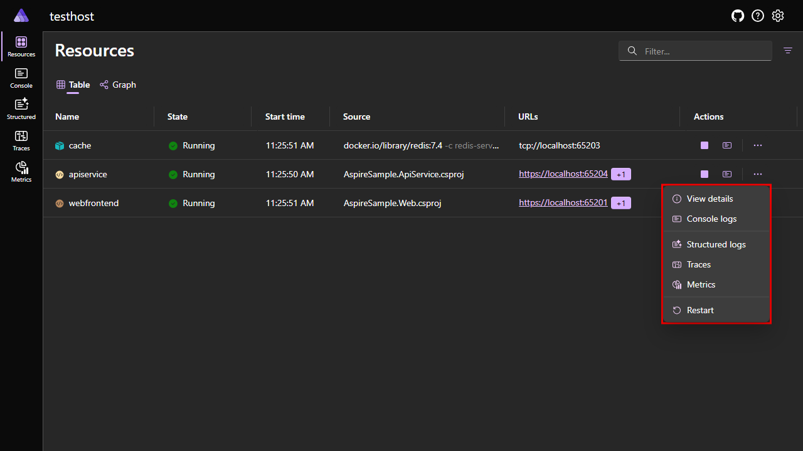
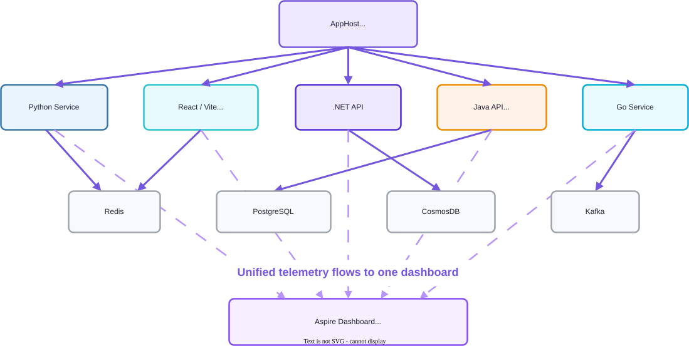
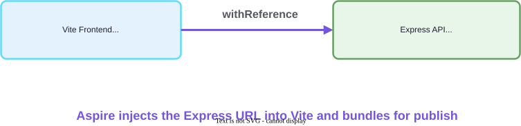
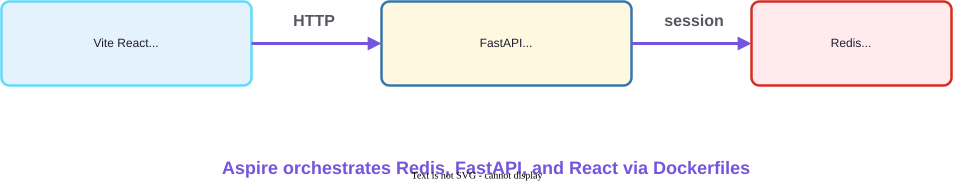
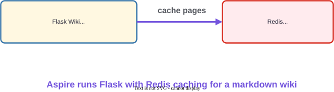
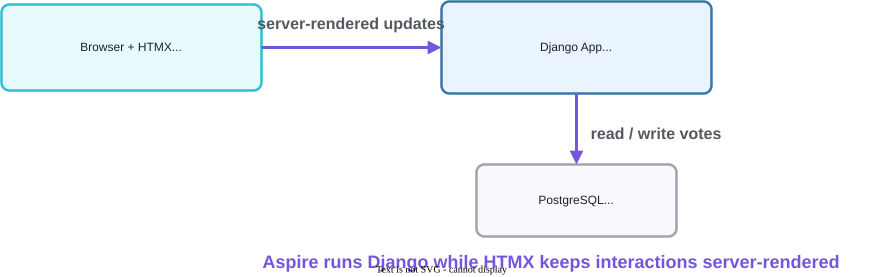
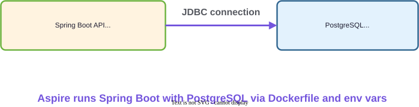
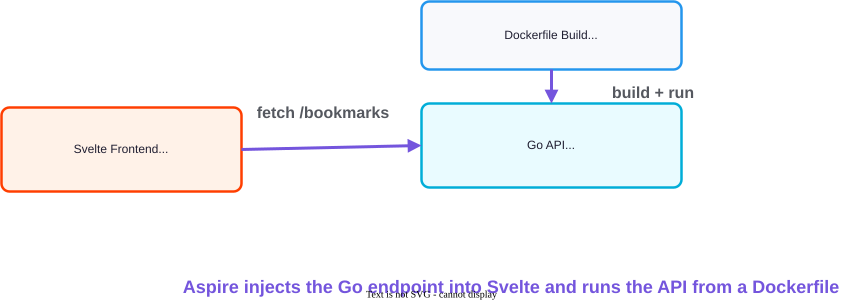
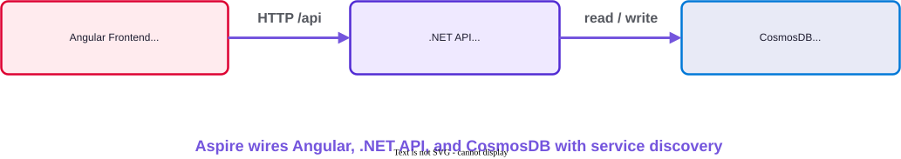
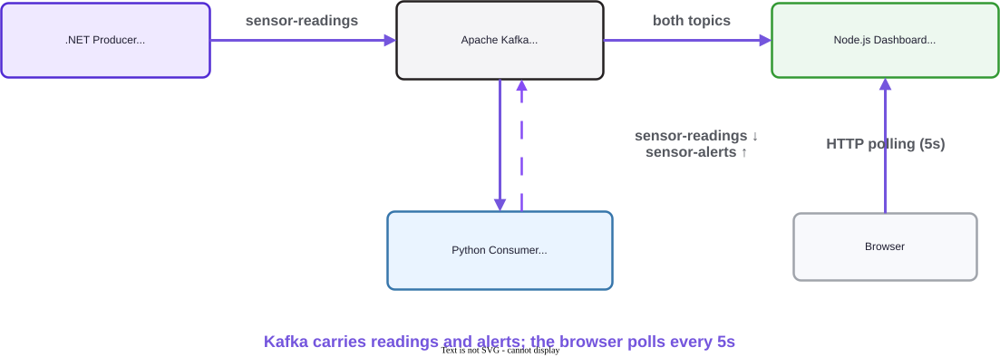

<!-- _footer: 'github.com/codebytes/aspire-polyglot' -->
<!-- _class: lead -->

# Polyglot Aspire

## One model for every service
## Chris Ayers


<!-- Speaker: Open with the outcome, not the product tour: one model, one run loop, one place to see the system. Ask for a show of hands: how many teams run more than two languages? -->

---


## Chris Ayers

### Principal Software Engineer<br>Azure Reliability · Microsoft

<i class="fa-brands fa-bluesky"></i> [@chris-ayers.com](https://bsky.app/profile/chris-ayers.com)  
<i class="fa-brands fa-linkedin"></i> [chris-l-ayers](https://linkedin.com/in/chris-l-ayers/)  
<i class="fa fa-window-maximize"></i> [chris-ayers.com](https://chris-ayers.com/)  
<i class="fa-brands fa-github"></i> [github.com/codebytes](https://github.com/codebytes)

<!-- Speaker: Keep this under 30 seconds. The audience needs a reason to trust the examples, not a résumé reading. -->

---

# The Polyglot Tax

> Every service may use the right language—and still create the wrong developer experience.

<div class="columns">
<div>

**The stack**

- Python for data and AI
- Go for small services
- Java for enterprise APIs
- TypeScript for web experiences
- .NET for platform services

</div>
<div>

**The friction**

- Five startup paths
- Hard-coded ports and URLs
- Infrastructure hidden in README steps
- Logs, traces, and health split across tools
- Deployment knowledge duplicated per service

</div>
</div>

<!-- Speaker: The problem is not language choice. It is the integration tax between languages. Transition: what if the team shared an application model instead of a runtime? -->

---

<!-- _class: gradient -->

# <!--fit--> One application model

<p class="hero-copy">Keep every runtime. Standardize how the system is composed, connected, observed, and shipped.</p>

<!-- Speaker: This is the thesis. Aspire is not a rewrite into .NET and not a production runtime. It is a code-first application model and developer workflow. -->

---

# The Journey

<div class="journey">
<div><strong>1 · Observe</strong><span>Start with OTLP and one dashboard</span></div>
<div><strong>2 · Compose</strong><span>Describe resources in an AppHost</span></div>
<div><strong>3 · Connect</strong><span>Inject endpoints, config, and readiness</span></div>
<div><strong>4 · Ship</strong><span>Publish or deploy to a configured target</span></div>
</div>

**Demo arc:** dashboard-only → TypeScript AppHost → preview AppHosts → three-runtime event stream → Docker Compose publish

<!-- Speaker: Set expectations. The talk builds capability in layers and the demos escalate deliberately. -->

---

<!-- _class: invert -->

# <!--fit--> Observe first

OpenTelemetry gives every runtime a common language

<!-- Speaker: Adoption does not have to begin with an AppHost. Start where the team already agrees: telemetry. -->

---

# Standalone Dashboard

### No AppHost. No .NET application. Any OTLP sender.

<div class="columns">
<div>

```bash
aspire dashboard run
```

- UI: `http://localhost:18888`
- OTLP/gRPC: `http://localhost:4317`
- OTLP/HTTP: `http://localhost:4318`
- Browser-token authentication by default

</div>
<div>

```bash
docker run --rm -it -d \
  -p 18888:18888 \
  -p 4317:18889 \
  -p 4318:18890 \
  --name aspire-dashboard \
  mcr.microsoft.com/dotnet/aspire-dashboard:latest
```

</div>
</div>

**Use it for development and short-lived diagnostics; telemetry is held in memory.**

<!-- Speaker: The CLI path is the shortest local setup. The container path is useful when the team already manages tooling with containers. Do not position this as a production observability backend. Source: aspire.dev/dashboard/standalone. -->

---

# Demo 1 · Dashboard-Only Telemetry

<div class="demo-card">
<strong>Sample:</strong> <code>samples/standalone-dashboard</code>
<span>Node.js worker · Python worker · Go worker</span>
</div>

**Show—3 minutes**

1. Start the dashboard and the three OTEL emitters.
2. Filter structured logs by service name.
3. Open one trace and follow spans across runtimes.
4. Call out what is intentionally absent: no AppHost resource graph.

**Takeaway:** OpenTelemetry is the on-ramp; orchestration can come later.

<!-- Speaker: Keep this demo tight. If container startup is slow, use the already-running instance. Transition: now add the missing resource model. -->

---

# One View of the Running System

<div class="columns dashboard-layout">
<div>

**Resources**  
State, endpoints, commands, and health

**Console + structured logs**  
One stream across processes and containers

**Traces + metrics**  
Correlate a request across runtime boundaries

**Export**  
Copy telemetry or a resource's environment as `.env`

</div>
<div>



<small>Dashboard UI evolves by release; the workflow remains the same.</small>

</div>
</div>

<!-- Speaker: The screenshot is a workflow anchor, not a promise that every icon is pixel-identical in the current release. Live demo the installed dashboard. -->

---

<!-- _class: invert -->

# <!--fit--> Compose the system

The AppHost describes resources and relationships—not business logic

<!-- Speaker: The AppHost is the executable architecture map. It can be authored in C# or TypeScript without constraining workload languages. -->

---

# Single-File C# AppHost

<div class="columns code-and-copy">
<div>

```csharp
#:sdk Aspire.AppHost.Sdk@13.5.3
#:package Aspire.Hosting.Redis@13.5.3

var builder = DistributedApplication.CreateBuilder(args);

var cache = builder.AddRedis("cache");

builder.AddProject<Projects.Api>("api")
       .WithReference(cache)
       .WaitFor(cache);

builder.Build().Run();
```

</div>
<div>

**`apphost.cs`**

- No AppHost `.csproj`
- SDK and packages declared in the file
- Excellent fit for polyglot repositories
- Requires the .NET 10 SDK for C# AppHost authoring

**Repo proof:** `dotnet-react-postgres`, `go-redis-compose`, `python-fastapi-docker`, and `java-javalin-redis`

</div>
</div>

<!-- Speaker: Distinguish file-based C# AppHosts from project-based AppHosts. “Single file” means no AppHost project file; workload projects can still exist. -->

---

# TypeScript AppHost Is First-Class

<div class="columns code-and-copy">
<div>

```typescript
import { createBuilder } from
  './.aspire/modules/aspire.mjs';

const builder = await createBuilder();
const cache = await builder.addRedis('cache');

await builder
  .addNodeApp('api', './api', 'src/index.ts')
  .withReference(cache);

await builder.build().run();
```

</div>
<div>

**Current layout:** `apphost.mts`

- Generated typed SDK in `.aspire/modules/`
- Same app model and integrations as C# through ATS
- Best fit for Node.js and TypeScript workspaces
- Requires a supported Node.js LTS runtime

**Repo note:** `ts-starter` and `vite-react-api` use the compatible pre-13.4 `apphost.ts` layout.

</div>
</div>

<!-- Speaker: Do not imply the checked-in samples already use the new layout. They are working legacy TypeScript AppHosts and make a useful migration discussion. -->

---

# AppHost Language ≠ Workload Language

<div class="status-grid">
<div class="status-card ga"><strong>Supported AppHosts</strong><span>C# · TypeScript</span></div>
<div class="status-card preview"><strong>Experimental AppHosts</strong><span>Python · Go · Java · Rust</span></div>
<div class="status-card workloads"><strong>Workloads</strong><span>Any process, project, container, or Dockerfile</span></div>
</div>

**Two independent choices**

1. Pick the AppHost language that fits the repository.
2. Pick the best language for each service.

Experimental AppHosts require explicit feature flags and may change between releases.

<!-- Speaker: This distinction prevents the most common misconception. C# and TypeScript are supported authoring choices. Python, Go, Java, and Rust AppHosts are experimental. This repo contains experimental Python, Go, and Java examples—no Rust sample. -->

---

# Bring Any Workload

<div class="columns">
<div>

**First-class helpers**

- `.NET` → `AddProject`, `AddCSharpApp`
- Node.js / Vite → `AddNodeApp`, `AddViteApp`
- Python → stable `AddPythonApp`, `AddUvicornApp`
- Bun → stable `AddBunApp`
- Go → `AddGoApp` in a preview-versioned package

</div>
<div>

**Universal escape hatches**

- Existing image → `AddContainer`
- Any Dockerfile → `AddDockerfile`
- Any command → `AddExecutable`
- Community integrations → Deno, Spring, and more

</div>
</div>

**The integration surface is a convenience—not a gate.**

<!-- Speaker: First-class integrations improve local run and publish behavior, but every workload can enter through a container, Dockerfile, or executable. In Aspire 13.5.3, Python and JavaScript hosting packages are stable; Aspire.Hosting.Go remains preview-versioned. This repo’s Go demo deliberately uses AddDockerfile. -->

---

<!-- _class: compact -->

# The Runtime Architecture



<div class="callout-row">
<span><strong>AppHost</strong> declares desired state</span>
<span><strong>DCP</strong> runs the dev-time resource model</span>
<span><strong>Dashboard</strong> displays resources and telemetry</span>
</div>

<!-- Speaker: DCP is the Developer Control Plane used for local orchestration. It is not the production runtime and should not be presented as a Kubernetes replacement. -->

---

<!-- _class: invert -->

# <!--fit--> Connect the pieces

References carry configuration; readiness controls startup

<!-- Speaker: This section explains the polyglot glue. Every runtime can read environment variables and emit OTLP. -->

---

# Service Discovery Is Configuration

**`WithReference(api)` injects endpoint configuration into the consumer.**

```text
services__api__http__0=http://localhost:5087
```

<div class="columns">
<div>

```python
api = os.environ[
  "services__api__http__0"
]
```

</div>
<div>

```typescript
const api = process.env[
  'services__api__http__0'
];
```

</div>
</div>

.NET services can also resolve logical URIs such as `https+http://api` through Aspire service discovery.

<!-- Speaker: Since Aspire 13.2, default endpoint variables use the endpoint scheme. Named endpoints keep the endpoint name. The environment variable is the universal cross-language contract. Source: aspire.dev/fundamentals/service-discovery. -->

---

# Reference Is Not Readiness

<div class="compare-grid">
<div>

## `WithReference(resource)`

- Injects endpoints or connection strings
- Declares a dependency relationship
- Does **not** guarantee the dependency is ready

</div>
<div>

## `WaitFor(resource)`

- Delays startup until the dependency is ready
- Uses health checks when available
- Prevents cold-start races

</div>
</div>

```csharp
var db = builder.AddPostgres("pg").AddDatabase("pollsdb");
builder.AddDockerfile("polls", "./src")
       .WithReference(db)
       .WaitFor(db);
```

<!-- Speaker: This correction matters. Several samples include WaitFor specifically because environment wiring alone did not prevent startup races. Health failures are reported; do not promise automatic restarts. -->

---

# Polyglot Configuration Contracts

<div class="contract-grid">
<div><strong>Endpoints</strong><code>services__api__http__0</code></div>
<div><strong>Connections</strong><code>ConnectionStrings__pollsdb</code></div>
<div><strong>Telemetry</strong><code>OTEL_EXPORTER_OTLP_ENDPOINT</code></div>
<div><strong>Ports</strong><code>PORT</code> via endpoint declarations</div>
</div>

**Aspire supplies values; each workload uses its native configuration system.**

- Python: `os.environ`
- Node.js: `process.env`
- Go: `os.Getenv`
- Java: `System.getenv`

<!-- Speaker: Preserve casing in Linux containers. ConnectionStrings uses PascalCase. Avoid promising that every image understands Aspire variables automatically—the workload still maps them into its client library. -->

---

# OpenTelemetry Is the Common Language

<div class="columns">
<div>

**Aspire provides**

- Dashboard OTLP endpoints
- Exporter environment variables for modeled resources
- Correlation across logs and traces
- Resource names that match the AppHost

</div>
<div>

**Each workload provides**

- An OpenTelemetry SDK or auto-instrumentation
- The correct OTLP protocol: gRPC or HTTP/protobuf
- Service-specific spans, metrics, and structured logs
- Browser-safe endpoint handling for frontends

</div>
</div>

**Repo proof:** every featured sample opts into telemetry explicitly where its runtime needs it.

<!-- Speaker: Do not bury the audience in language-specific SDK boilerplate. Show one trace in the demo instead. Browser apps cannot use OTLP/gRPC; the TypeScript starter deliberately selects HTTP/protobuf. -->

---

<!-- _class: purple -->

# <!--fit--> Demo the model

Four live stops · three rapid tours · one publish proof

<!-- Speaker: Reset the room. The conceptual model is complete; now validate it with working samples. -->

---

# Demo Run of Show

<div class="timeline">
<div><strong>3 min</strong><span>Standalone dashboard</span></div>
<div><strong>4 min</strong><span>TypeScript starter</span></div>
<div><strong>5 min</strong><span>Preview AppHost tour</span></div>
<div><strong>5 min</strong><span>Polyglot event stream</span></div>
<div><strong>3 min</strong><span>Publish to Compose</span></div>
</div>

**Live:** `standalone-dashboard` · `ts-starter` · `polyglot-event-stream` · `go-redis-compose`

**Rapid tour / fallback recording:** Flask · Django · Spring Boot · Svelte + Go · Angular

<!-- Speaker: Cap demos at 20 minutes. Pre-warm images and dependencies. Never cold-build experimental guest AppHosts on stage; keep screenshots or recordings ready. -->

---

<!-- _class: compact -->

# Demo 2 · TypeScript Starter

<div class="chips"><span class="host">TypeScript AppHost</span><span>Express</span><span>React</span><span>Vite</span><span>Browser OTEL</span></div>



**Show:** resource graph → browser trace → `publishWithContainerFiles`

<!-- Speaker: Use the legacy apphost.ts sample as checked in. Explain that current scaffolding uses apphost.mts, but the model is the same. The frontend selects OTLP/HTTP and is bundled into the API container for publish. -->

---

<!-- _class: compact -->

# TypeScript Orchestrates Python Too

<div class="chips"><span class="host">TypeScript AppHost</span><span>React</span><span>FastAPI</span><span>Redis</span><span>Dockerfiles</span></div>



**Point out:** TypeScript authors the model; Python remains Python; Redis is just another resource.

<!-- Speaker: This is a 60-second extension of the TypeScript demo, not a second full live demo. The sample uses AddDockerfile for both application resources and explicitly configures OTLP. -->

---

<!-- _class: compact -->

# Rapid Tour · Python AppHost + Flask

<div class="chips"><span class="host">Python AppHost · experimental</span><span>Flask</span><span>Redis</span><span>Dockerfile</span></div>



**Sample-backed pattern:** `add_redis` + `add_dockerfile` + `with_reference` + `wait_for`

<!-- Speaker: Tour the AppHost source, not a cold start. The feature is experimental and gated. The sample runs Flask from a Dockerfile and waits for Redis health. -->

---

<!-- _class: compact -->

# Rapid Tour · Python AppHost + Django

<div class="chips"><span class="host">Python AppHost · experimental</span><span>Django</span><span>HTMX</span><span>PostgreSQL</span></div>



**Sample-backed pattern:** database resource → injected `ConnectionStrings__pollsdb` → readiness gate

<!-- Speaker: The canonical sample uses PostgreSQL, not SQLite. Django reads the injected connection string and waits for the database to become healthy. -->

---

# Experimental Means Experimental

<div class="risk-grid">
<div><strong>Pre-warm</strong><span>Restore generated modules and pull images before the session.</span></div>
<div><strong>Time-box</strong><span>Tour source and the dashboard; do not debug toolchain startup live.</span></div>
<div><strong>Fallback</strong><span>Keep a short recording or screenshot for every preview demo.</span></div>
</div>

**The message is capability—not a promise of GA stability.**

<!-- Speaker: Make the preview boundary explicit before Java and Go. Python, Go, and Java guest AppHosts can have slower first startup while modules restore or build. -->

---

<!-- _class: compact -->

# Rapid Tour · Java AppHost

<div class="chips"><span class="host">Java AppHost · experimental</span><span>Spring Boot</span><span>PostgreSQL</span><span>Dockerfile</span></div>



**Sample-backed pattern:** Java authors the model; Spring Boot and PostgreSQL run as containers.

<!-- Speaker: The sample manually supplies JDBC settings and waits for PostgreSQL. Do not claim AddSpringApp here—the checked-in sample uses AddDockerfile. -->

---

<!-- _class: compact -->

# Rapid Tour · Go AppHost

<div class="chips"><span class="host">Go AppHost · experimental</span><span>Go API</span><span>Svelte</span><span>PostgreSQL</span></div>



**Sample-backed pattern:** Go authors the model; API uses `AddDockerfile`; frontend uses `AddExecutable`.

<!-- Speaker: Separate AppHost language from workload integration. This is an experimental Go AppHost, but it does not demonstrate the newer AddGoApp integration. That migration appears later. -->

---

<!-- _class: compact -->

# Production-Shaped C# AppHost

<div class="chips"><span class="host">C# AppHost</span><span>Angular</span><span>.NET API</span><span>Cosmos DB emulator</span></div>



**Show if time:** browser OTLP/HTTP configuration and API service discovery.

<!-- Speaker: This is a backup demo. The AppHost uses AddJavaScriptApp, AddProject, and the Cosmos emulator. It is useful when the audience wants a more traditional .NET-centered architecture. -->

---

<!-- _class: compact -->

# Demo 3 · The Polyglot Payoff

<div class="chips"><span class="host">C# AppHost</span><span>.NET producer</span><span>Python consumer</span><span>Node.js dashboard</span><span>Kafka</span></div>



**Show:** event created → Kafka flow → consumer log → correlated trace → live dashboard update

<!-- Speaker: This is the narrative climax. Do not tour every file. Follow one event across three runtimes and return to the opening promise: one model and one view. -->

---

# Demo 4 · Publish to Docker Compose

<div class="columns code-and-copy">
<div>

```csharp
builder.AddDockerComposeEnvironment("compose");

var cache = builder.AddContainer(
  "cache", "redis", "7-alpine");

builder.AddDockerfile("api", "src/api")
       .WithEnvironment("REDIS_HOST", "cache")
       .WaitFor(cache);
```

```bash
aspire publish
# aspire-output/docker-compose.yaml
```

</div>
<div>

**Sample:** `samples/go-redis-compose`

- C# single-file AppHost
- Go API built from its Dockerfile
- Redis from a public image
- Docker Compose environment declared in the model

**Important:** publishing requires a configured target; Aspire does not invent production architecture.

</div>
</div>

<!-- Speaker: Open the generated Compose file, then run it only if time permits. `aspire publish` generates artifacts. `aspire deploy` executes the configured deployment pipeline. Both commands are GA in current releases. -->

---

# Newer Integrations: Demoed vs Next

<div class="integration-map">
<div class="demoed"><strong>Demonstrated in this repo</strong><span>JavaScript + Vite · Python · .NET · containers · Dockerfiles · executables · Redis · PostgreSQL · Kafka · Cosmos DB</span></div>
<div class="next"><strong>Intentional next migrations</strong><span><code>svelte-go-bookmarks</code>: test preview-package <code>AddGoApp</code><br><code>ts-starter</code>: add a small Bun resource with stable <code>AddBunApp</code><br>Add a dedicated Blazor WASM sample before claiming that preview integration on stage</span></div>
</div>

**Rule:** no live claim without a working sample and a rehearsed fallback.

<!-- Speaker: Current 13.5.3 options include stable AddBunApp, stable Python/Uvicorn hosting, preview-versioned Aspire.Hosting.Go, path-based AddCSharpApp, and preview Blazor WASM hosting. This repository does not yet prove those newer APIs, so tie them to explicit follow-ups instead of pretending they are demoed. -->

---

# Agent-Ready—One Supported MCP Path

<div class="columns">
<div>

```bash
aspire agent init
aspire run
```

**Preferred first:** Aspire workflow skills teach setup, orchestration, monitoring, deployment, and Aspire-ification.

</div>
<div>

```json
{
  "servers": {
    "aspire": {
      "type": "stdio",
      "command": "aspire",
      "args": ["agent", "mcp"]
    }
  }
}
```

</div>
</div>

The CLI-hosted MCP server exposes resources, logs, traces, integration docs, diagnostics, and resource commands. **The former dashboard-embedded MCP server has been removed.**

<!-- Speaker: Correct the old “two MCP servers” story. Skills are preferred for workflow knowledge; add MCP when the agent needs live runtime data. STDIO opens no network listener. Source: aspire.dev/get-started/aspire-mcp-server. -->

---

# Start Small

<div class="steps-grid">
<div><strong>1</strong><span>Install the Aspire CLI</span><a href="https://get.aspire.dev">get.aspire.dev</a></div>
<div><strong>2</strong><span>Add an AppHost</span><code>aspire init</code></div>
<div><strong>3</strong><span>Model one dependency</span><code>aspire add redis</code></div>
<div><strong>4</strong><span>Run and inspect</span><code>aspire run</code></div>
</div>

**Requirements depend on AppHost language:** C# uses .NET 10; TypeScript uses a supported Node.js LTS runtime.

**Then:** add telemetry → replace hard-coded endpoints → add readiness → configure a publish target.

<!-- Speaker: Give the audience a sequence they can execute tomorrow. Avoid listing the entire CLI. -->

---

# Takeaways

<div class="takeaways">
<div><strong>Keep the languages.</strong><span>Standardize the application model, not the runtime.</span></div>
<div><strong>Adopt in layers.</strong><span>Dashboard first, AppHost next, deployment target when ready.</span></div>
<div><strong>Make dependencies explicit.</strong><span>Reference for configuration; wait for readiness.</span></div>
<div><strong>Prove every demo.</strong><span>Separate supported, experimental, and not-yet-sampled capabilities.</span></div>
</div>

<!-- Speaker: Pause after each line. Final sentence: “One model is enough to make a five-language system feel like one application.” -->

---

# Resources

<div class="columns resources-layout">
<div>

- [Aspire documentation](https://aspire.dev/docs/)
- [Aspire 13.5.3 release guidance](https://aspire.dev/whats-new/aspire-13-5/)
- [Polyglot Aspire samples](https://github.com/codebytes/aspire-polyglot)
- [Service discovery](https://aspire.dev/fundamentals/service-discovery/)
- [Standalone dashboard](https://aspire.dev/dashboard/standalone/)
- [Aspire MCP server](https://aspire.dev/get-started/aspire-mcp-server/)

</div>
<div>

## Follow Chris Ayers


</div>
</div>

<!-- Speaker: Leave this slide up for photos. The QR code resolves to Chris's link page. -->

---

# Questions?


<!-- Speaker: Keep the final slide visually quiet. If discussion stalls, ask: “Which dependency in your local stack is hardest to make reliable?” -->
