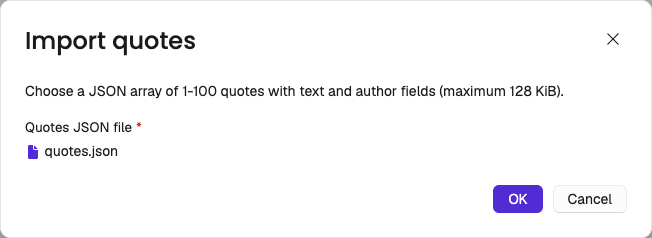

<!-- _footer: 'https://github.com/codebytes/aspire-polyglot' -->
<!-- _class: lead -->

# Polyglot Aspire

<p class="cover-tagline">One app model.<br><strong>Any AppHost.<br>Any workload.</strong></p>

## Chris Ayers

---


## Chris Ayers

### Principal Software Engineer<br>Azure EngOps AzRel<br>Microsoft

<i class="fa-brands fa-bluesky"></i> BlueSky: [@chris-ayers.com](https://bsky.app/profile/chris-ayers.com)
<i class="fa-brands fa-linkedin"></i> LinkedIn: - [chris\-l\-ayers](https://linkedin.com/in/chris-l-ayers/)
<i class="fa fa-window-maximize"></i> Blog: [https://chris-ayers\.com/](https://chris-ayers.com/)
<i class="fa-brands fa-github"></i> GitHub: [Codebytes](https://github.com/codebytes)
<i class="fa-brands fa-mastodon"></i> Mastodon: [@Chrisayers@hachyderm.io](https://hachyderm.io/@Chrisayers)

---

# The Polyglot Problem

> Modern apps are an **orchestra with no conductor**, and for polyglot teams,
> every section is reading from a different score.

Your team doesn't use one language. It uses **five**.

**Your stack today**
- Python ML services
- Go microservices
- Java Spring Boot APIs
- TypeScript/React frontends
- .NET backend APIs

**The question:** How do you orchestrate, observe, and wire all of this **from one place**?

<!-- We've all been there. The README says "just run docker-compose up" but it never works the first time. Five languages, one app, no map. -->

---

<!-- _class: compact -->

# The Orchestration Pain

**Five stacks. Five toolchains. Zero shared model.**

- 🚢 **Docker Compose**: explicit endpoint, dependency, and health-check configuration; telemetry is separate
- 📄 **Config sprawl**: `.env`, YAML, `application.properties`, `appsettings.json`, each with its own format
- 🔍 **No unified observability**: good luck tracing a request across four services in three runtimes
- 📜 **15-step READMEs**: "just `docker-compose up`" never works first time

<!--
Compose supports health-aware startup with healthcheck and depends_on.condition: service_healthy. The contrast is the configuration you maintain and the separate telemetry tooling, not a missing Compose capability.
Source: https://docs.docker.com/compose/how-tos/startup-order/
-->

---

<!-- _class: gradient -->

# <!--fit--> Aspire: The Polyglot Answer

<p style="color:#ffffff; font-weight:500; max-width:1000px; margin:0.5em auto 0;">Aspire is an agent-ready, code-first tool to compose, debug, and deploy any distributed app.</p>

<!-- Use the official positioning sentence verbatim. It sets up everything that follows. Then transition to the four pillars. -->

---

<!-- _class: compact -->

# What Collapses Into One

**An illustrative five-service team—not a measured benchmark:**

<div class="chart">
<div class="hbars">
<div class="metric"><div class="name">Startup commands</div><div class="group"><div class="bar before" style="width:100%">5</div><div class="bar after" style="width:20%">1</div></div></div>
<div class="metric"><div class="name">Connection-wiring sources</div><div class="group"><div class="bar before" style="width:80%">4</div><div class="bar after" style="width:20%">1</div></div></div>
<div class="metric"><div class="name">Observability panes</div><div class="group"><div class="bar before" style="width:60%">3</div><div class="bar after" style="width:20%">1</div></div></div>
</div>
<div class="legend"><span class="key k-before">Without Aspire</span><span class="key k-after">With Aspire</span></div>
</div>

<!-- This is an illustrative before/after workflow, not repository benchmark data. One aspire run can coordinate five startup commands; the AppHost centralizes endpoint wiring previously spread across four places, and the dashboard brings telemetry into one view. Language toolchains and application configuration files still exist. Generated deployment artifacts can still include YAML and .env files. -->

---

<!-- _class: compact -->

# The Four Pillars

<div class="pillars">
<div class="entablature">Polyglot Aspire</div>
<div class="architrave"></div>
<div class="cols">

<div class="pillar p1">
<div class="cap"></div>
<div class="shaft">
<div class="icon">🛠</div>
<div class="pname">Aspire CLI</div>
<div class="ptag">Control plane</div>
<div class="pdesc">One command set to start, inspect, and deploy the stack.</div>
</div>
<div class="base"></div>
</div>

<div class="pillar p2">
<div class="cap"></div>
<div class="shaft">
<div class="icon">🗺</div>
<div class="pname">Aspire AppHost</div>
<div class="ptag">Stack in code</div>
<div class="pdesc">Services, dependencies, and endpoints declared together in code.</div>
</div>
<div class="base"></div>
</div>

<div class="pillar p3">
<div class="cap"></div>
<div class="shaft">
<div class="icon">📊</div>
<div class="pname">Aspire Dashboard</div>
<div class="ptag">App at a glance</div>
<div class="pdesc">Resource state, logs, traces, metrics, and interactive terminals.</div>
</div>
<div class="base"></div>
</div>

<div class="pillar p4">
<div class="cap"></div>
<div class="shaft">
<div class="icon">🧩</div>
<div class="pname">Aspire Integrations</div>
<div class="ptag">Building blocks</div>
<div class="pdesc"><strong>100+</strong> packages for data, messaging, AI, and clouds.</div>
</div>
<div class="base"></div>
</div>

</div>
</div>

<!-- Four pillars hold up the whole model: the CLI drives it, the AppHost declares it, the Dashboard shows it, and Integrations plug into it. Same four regardless of language. -->

---

<!-- _class: compact -->

# One Orchestrator. Every Language.

<div class="polyglot-flow">
<div class="flow-panel">

## Workload runtimes

🐍 Python · 🐹 Go · ☕ Java<br>
🟦 TypeScript · 💜 .NET

</div>
<div class="flow-hub">

## Aspire AppHost

**C# · TypeScript**<br>
<small>Python · Go · Java (preview)</small>

one run · one model

</div>
<div class="flow-panel">

## Same capabilities

🎯 Orchestration<br>
🔗 Service discovery<br>
📊 OpenTelemetry

</div>
</div>

<!-- Polyglot has two independent axes: the language used to author the AppHost and the languages used by its workloads. Five languages funnel into one orchestrator, and out come the same three capabilities: orchestration, service discovery, and observability. -->

---

<!-- _class: code-focus -->

# AppHost Language ≠ Workload Language

**One C# AppHost can wire Python, React, and .NET:**

```csharp
var builder = DistributedApplication.CreateBuilder(args);

var cache = builder.AddRedis("cache");
var ml = builder.AddUvicornApp("ml", "../python", "main:app")
    .WithHttpEndpoint(env: "PORT")
    .WithReference(cache);

builder.AddViteApp("web", "../react").WithReference(ml);
builder.AddProject<Projects.Api>("api").WithReference(cache);
builder.Build().Run();
```

<!-- The AppHost language never constrains the workload languages. This C# file starts Python, React/TypeScript, and .NET, then exposes all of them through the same dashboard and service-discovery model. -->

---

<!-- _class: compact release-slide dashboard-slide -->

# The Dashboard: One View for Everything

<figure class="release-screenshot">

<figcaption>Source: <a href="https://aspire.dev/whats-new/aspire-13-5/">Microsoft Aspire 13.5 release notes</a></figcaption>
</figure>

**13.5:** Refreshed resource views, clearer health states, faster filtering, and sharper telemetry search.

Add OpenTelemetry to your services; Aspire supplies `OTEL_EXPORTER_OTLP_ENDPOINT`.

<!--
Show the dashboard early: resources expose state, endpoints, and actions; console logs capture stdout/stderr; structured logs, traces, and metrics come through OpenTelemetry.
In 13.5, demonstrate a case-insensitive console-log search, then narrow logs or traces by timestamp and exact numeric comparisons.
Screenshot is the official release-note example, not a capture of this repository's demos.
Source: https://aspire.dev/whats-new/aspire-13-5/
Image: https://aspire.dev/_astro/projects.DUzpqXcM_Z1aIiSQ.webp
-->

---

<!-- _class: compact -->

# Demo: TypeScript Starter

<div class="chips"><span class="host">TypeScript AppHost</span><span>Express</span><span>React</span><span>Vite</span></div>


**Live:** Refresh the forecast → switch °F / °C → inspect an API trace.

<!--
Show a working app before the deeper mechanics. From samples/ts-starter, run aspire run --apphost apphost.mts (or use aspire start --isolated for a background worktree run). Open the frontend endpoint from aspire describe.
Point to apphost.mts: addNodeApp, addViteApp, withReference, and waitFor define this topology. In the UI, refresh the five-day forecast and toggle Fahrenheit/Celsius. In Aspire, open a frontend/API trace to connect the visible interaction to the model.
The HTTP/protobuf collector is configured separately from the API's gRPC collector. Keep the workload toolchains installed. Stop this sample with aspire stop --apphost apphost.mts before the next live stack.
Transition: now that we have seen the result, unpack service discovery, dependencies, and the other resource types.
-->

---

<!-- _class: compact release-slide terminal-slide -->

# Not Everything Is an HTTP Service

**Experimental in 13.5:** REPLs, shells, and TUIs are resources too.

<figure class="release-screenshot">

<figcaption>Cropped from the <a href="https://devblogs.microsoft.com/aspire/whats-new-aspire-13-5/">Microsoft Aspire 13.5 announcement</a></figcaption>
</figure>

<div class="columns dashboard-columns">
<div>

Enable `.WithTerminal()` / `.withTerminal()` on a resource.

**Real input and output. One session, multiple viewers.**

</div>
<div>

```bash
cd samples/terminal-demo
aspire terminal ps
aspire terminal attach node-repl
```

</div>
</div>

<!--
The screenshot shows Microsoft's JavaScript guessing-game playground. The commands use this repository's terminal-demo instead: start it with aspire run, evaluate 6 * 7 and process.stdin.isTTY in node-repl, and attach from another terminal to see the same session. Ctrl+B then D detaches without ending the process.
WithTerminal() and the terminal CLI are experimental in 13.5. C# callers must suppress ASPIRETERMINAL001. terminal-demo enables features.terminalCommandsEnabled in its local aspire.config.json. For a different AppHost, enable that flag before using the terminal CLI; the dashboard terminal does not require the CLI flag.
Terminal-enabled resources run as plain processes and do not get automatic debugger attachment. Attach the debugger manually from your IDE when needed.
Sources: https://aspire.dev/app-host/with-terminal/ and https://aspire.dev/reference/cli/commands/aspire-terminal/
Image: https://devblogs.microsoft.com/aspire/wp-content/uploads/sites/90/2026/08/aspire-terminal-guessing-game.webp (cropped to the interactive content).
-->

---

<!-- _class: code-reference -->

# Observability Without Rewrites

**Already emitting OpenTelemetry? Add a standalone dashboard.**

```bash
docker run --rm -d --name aspire-demo-dashboard \
  -p 127.0.0.1:18888:18888 \
  -p 127.0.0.1:4317:18889 -p 127.0.0.1:4318:18890 \
  mcr.microsoft.com/dotnet/aspire-dashboard:latest

docker logs aspire-demo-dashboard
```

**Open the login URL from the logs.** UI: `18888` · OTLP/gRPC: `4317` · OTLP/HTTP: `4318`

**No .NET app required.** Adopt the AppHost when you also need service wiring and lifecycle.

<!--
Keep this as the adoption bridge: observability first, orchestration when the team is ready. The detached Docker command prints a container ID, not its browser login URL; docker logs retrieves the authenticated URL.
The standalone container retains browser-token authentication. Incoming OTLP is unauthenticated by default, so these mappings intentionally bind only to loopback for a local demo. Applications still need their OpenTelemetry SDK/exporter configured. Use docker stop aspire-demo-dashboard to clean up; --rm removes the stopped container.
The AppHost, not the dashboard, adds service discovery and resource lifecycle. This repository's standalone-dashboard sample supplies three language workers if a complete telemetry demo is useful.
Sources: https://aspire.dev/dashboard/standalone/ and https://aspire.dev/dashboard/security-considerations/
-->

---

<!-- _class: compact -->

# Architecture Overview

**AppHost orchestrates everything: DCP manages processes, Dashboard collects telemetry**


<!-- The AppHost is the central orchestrator. All services report their telemetry to the unified dashboard. -->

---

<!-- _class: invert -->

# <!--fit--> How It Works

The patterns that make polyglot orchestration possible

<!-- Now let's look at the mechanisms under the hood. -->

---

# Service Discovery: The Pattern

**Aspire injects service endpoints as environment variables:**

```bash
# Pattern: services__<name>__<protocol>__<index>
services__api__http__0=http://localhost:5000
services__frontend__http__0=http://localhost:3000
```

**Why double underscore?** `__` represents configuration hierarchy using shell-friendly names.

**No hardcoded service addresses.** Application configuration and toolchains stay in place.

<!-- Environment names are a portable interface across language runtimes. Double underscores represent the hierarchy in shell-friendly names; do not imply that framework configuration or deployment .env files disappear. -->

---

# Connection Strings: The Pattern

**Connection strings use `ConnectionStrings__<resource>`:**

```text
ConnectionStrings__messaging=localhost:9092
ConnectionStrings__recipesdb=<provider connection string>
```

**Typed Redis resources also expose `CACHE_URI`. Use the complete URI:**

```python
import os
import redis

client = redis.Redis.from_url(os.environ["CACHE_URI"])
```

**Case matters in Python/Linux. A connection string is not always a URI.**

<!--
Service discovery and connection strings share one universal interface: environment variables. Use the exact ConnectionStrings__ casing; Linux environment lookups are case-sensitive.
AddRedis("cache") plus WithReference exposes CACHE_URI and individual connection properties. CACHE_URI preserves the scheme, host, port, and credentials. Prefixing a StackExchange-style connection string with redis:// does not convert it to a valid URI. A preconfigured AddConnectionString resource exposes the connection string rather than the typed Redis properties.
Source: https://aspire.dev/integrations/caching/redis/redis-connect/
-->

---

<!-- _class: compact -->

# Resource Lifecycle Management

<div class="lifecycle-visual">

</div>

<div class="lifecycle-caption">Aspire keeps startup order, monitoring, and shutdown coordinated across the whole app.</div>

**Startup Gating:** `WaitFor(...)` holds dependents until a resource is ready
**Health Monitoring:** `WithHttpHealthCheck("/health")` reports readiness and status
**Graceful Shutdown:** Clean termination of all processes
**Backed by 100+ integrations**: Postgres, Redis, Kafka, Cosmos, OpenAI, Ollama, and your own containers all participate in the same lifecycle.

<!--
WithReference wires configuration; it does not itself impose startup ordering. Use WaitFor to gate a dependent resource on its dependency's readiness. With a registered health check, WaitFor waits for healthy; without one, it waits for the Running state.
WithHttpHealthCheck reports readiness and dashboard status. It does not by itself promise automatic restarts on failure. Production liveness probes and restart policies belong to the deployment orchestrator.
Source: https://aspire.dev/fundamentals/health-checks/
-->

---

# The AppHost: C#

**Write your AppHost in the language your team knows. Here's C#:**

```csharp
var builder = DistributedApplication
    .CreateBuilder(args);

var redis = builder.AddRedis("cache");

builder.AddPythonApp("api", "../api", "app.py")
       .WithReference(redis)
       .WithHttpEndpoint(env: "PORT");

builder.Build().Run();
```

**100+ integrations** like Redis, Azure, Kafka, MongoDB, and PostgreSQL are available out of the box.

<!-- C# is the original AppHost language. Most existing samples use this. -->

---

<!-- _class: code-focus -->

# The AppHost: TypeScript

**GA since 13.4. Aspire 13.5 closes more parity gaps with C#.**

```typescript
import { createBuilder } from "./.aspire/modules/aspire.mjs";

const builder = await createBuilder();

const cache = await builder.addRedis("cache");
const api = await builder.addPythonApp("api", "../api", "app.py")
  .withReference(cache);

await builder.addViteApp("web", "../web").withReference(api);
await builder.build().run();
```

**Same integration model via ATS.** 13.5 adds custom health checks, container files, HTTPS certificates, and richer interactions.

<!--
TypeScript AppHosts became GA in 13.4, when ASPIREATS001 was retired. Aspire 13.5 closes more parity gaps with C#. This does not make every experimental AppHost authoring language GA: keep Python, Go, and Java preview labels separate from workload support.
Custom checks use builder.addHealthCheck(name, check) and resource.withHealthCheck(key). withContainerFiles and withContainerFilesCallback copy or generate container files. Keep these as examples of parity, not another API walkthrough.
Current entry points use apphost.mts. aspire update --migrate can migrate older apphost.ts projects.
Sources: https://aspire.dev/whats-new/aspire-13-4/ and https://aspire.dev/whats-new/aspire-13-5/
-->

---

<!-- _class: paced -->

# Start with a Workload Integration

**Keep the workload's toolchain. Let Aspire model how it runs.**

- 🐍 Python / ASGI → `AddPythonApp()` · `AddUvicornApp()`
- 🟦 JavaScript / TypeScript → `AddJavaScriptApp()` · `AddNodeApp()`
- ⚡ Vite frontend → `AddViteApp()`
- 💜 .NET project → `AddProject<T>()`
- 🐹 Go / Bun → `AddGoApp()` · `AddBunApp()`

**Prefer a typed integration when one fits.**

<!--
This is a choice map, not a list to memorize. Start with the workload the team already has and select its typed integration. Go (Aspire.Hosting.Go) and Bun (Aspire.Hosting.JavaScript) graduated into core in 13.4.
Pause here: these are helpers for running familiar tools, not replacement language runtimes. Next, show how community integrations and the general-purpose resource types cover the rest of a real stack.
-->

---

<!-- _class: paced -->

# Bring the Rest of Your Stack

<div class="columns">
<div>

## More integrations

- Deno: `AddDenoApp()` / `AddDenoTask()`
- Spring Boot: `AddSpringApp()`
- Blazor WASM: `AddBlazorWasmProject()`

Deno and Spring: **Community Toolkit**.<br>Blazor hosting: **preview**.

</div>
<div>

## Universal options

- `AddDockerfile()` — build an image
- `AddContainer()` — use an image
- `AddExecutable()` — run a process

**If it runs, it can join the model.**

</div>
</div>

Infrastructure joins the same graph: **Redis · PostgreSQL · Kafka · Cosmos DB**.

<!--
Keep this separate from the first-party workload slide so the audience can see the escape hatches without losing the primary recommendation.
The backing-service APIs include AddRedis, AddPostgres(...).AddDatabase(...), AddKafka, and AddAzureCosmosDB. Our recipe demo uses RunAsPreviewEmulator for its local Cosmos DB instance. Hosting packages and preview status vary by integration.
The repository demonstrates both typed integrations and raw Dockerfile/container/executable resources. A raw container still needs explicit connection configuration and any health checks the application requires.
-->

---

<!-- _class: code-reference -->

# Wire Connections and Readiness

```csharp
.WithReference(redis)           // pass connection info
.WaitFor(postgres)              // wait for readiness
.WithHttpEndpoint(env: "PORT")   // expose HTTP
.WithExternalHttpEndpoints()    // public ingress
.WithHttpHealthCheck("/health") // readiness probe
```

**A reference supplies configuration. A wait supplies startup ordering.**

<!--
Keep the visible example focused on connection and lifecycle wiring, rather than mixing several catalogs. Reconnect this to the earlier lifecycle slide.
Other useful helpers include WithUv and WithNpm for package managers. WithMcpServer describes a resource's own MCP endpoint; it is separate from the Aspire CLI's runtime MCP server discussed later.
-->

---

<!-- _class: invert -->

# Practical Setup

Repeatable workflows. Familiar tools. Agents with live context.

<!-- Keep this section about the developer's workflow, not the structure of aspire.config.json. -->

---

<!-- _class: code-reference -->

# Turn README Steps into Resource Commands

**Define a workflow once. Use it from the dashboard or CLI.**

**Quotes Board:** one custom `seed` command, two interfaces.

```bash
cd samples/dotnet-react-postgres
aspire resource api seed --help
aspire resource api seed --count 5
```

<div class="command-row">
<div><strong>Dashboard</strong><span>collects named inputs</span></div>
<div><strong>CLI</strong><span>accepts named options</span></div>
</div>

**Stable in 13.5:** command arguments and core prompts.

<!--
Connect this to the 15-step README problem: an integration author can make import, seed, or reset actions part of the resource model.
This is implemented in samples/dotnet-react-postgres/apphost.cs, not a built-in Aspire command. Start that AppHost first. The command appends 1-100 demo quotes through the API; the default count is 5. A count of 0 fails before any database write.
Declare CommandOptions.Arguments and read ExecuteCommandContext.Arguments; TypeScript has the corresponding ATS exports. The dashboard collects inputs while the CLI accepts named options and reports missing required values. If an argument collides with an Aspire option, separate command options with --.
Pause on the shared workflow before introducing richer input. Sources: https://aspire.dev/fundamentals/custom-resource-commands/ and https://aspire.dev/reference/cli/commands/aspire-resource/
-->

---

<!-- _class: release-slide -->

# Let a Command Ask for a File

<div class="columns">
<div>

## A guided import

- Choose `quotes.json`
- Validate content and size
- Import the whole batch

**Stable:** file inputs.<br>**Experimental:** progress dialogs.

</div>
<div>

<figure class="release-screenshot">

<figcaption>Live Quotes Board sample · Aspire dashboard</figcaption>
</figure>

</div>
</div>

<!--
This is the actual Quotes Board file picker, not an illustrative release screenshot. Import quotes uses PromptInputAsync with InputType.File, a .json filter, and a 128 KiB maximum. The AppHost validates uploaded bytes and calls the API's development-only batch endpoint. The entire batch is validated before a PostgreSQL transaction writes it.
File imports are dashboard-only in this sample; seed supports both the CLI and dashboard. Canceling before confirmation adds nothing, and demo/invalid-quotes.json demonstrates whole-batch rejection.
File inputs and core prompts are stable. Progress dialogs with optional cancellation remain experimental (ASPIREINTERACTION001); they are a dashboard interaction, not a prerequisite for a CLI command.
Source: https://aspire.dev/whats-new/aspire-13-5/
Image: captured from samples/dotnet-react-postgres using Aspire 13.5.3.
-->

---

<!-- _class: paced -->

# Demo: Quotes Board Commands

<div class="chips"><span class="host">C# AppHost</span><span>React</span><span>PostgreSQL</span></div>

**Seed from the terminal. Import from the dashboard.**

```bash
aspire resource api seed --count 5
```

<div class="command-row">
<div><strong>Seed quotes</strong><span>one named count argument</span></div>
<div><strong>Import quotes</strong><span>choose demo/quotes.json</span></div>
</div>

Click **Refresh quotes** → see new entries and the updated count.

**Same application. Two repeatable workflows.**

<!--
Stop the previous demo's AppHost first. From samples/dotnet-react-postgres run aspire start --apphost apphost.cs --isolated, then aspire wait api --apphost apphost.cs --status healthy. Open the dashboard and the web resource in separate tabs.
Run aspire resource api seed --count 5. Show the added count and IDs, then Refresh quotes in the board. Alternatively choose api > Actions > Seed quotes to show the same named argument in a dialog.
Next choose api > Actions > Import quotes, select demo/quotes.json, and click OK. The JSON result reports added: 3. Refresh the board and point to the three fixture authors.
If time permits, import demo/invalid-quotes.json and show the failed operation and unchanged count. Both commands append; this is not a reset or deduplicating import. No bespoke admin UI was needed.
The source stays file-based: TreatProjectReferencesAsResources=false shares API validation as a normal assembly reference, while AddProject registers the API by path. Stop with aspire stop --apphost apphost.cs; preserve the data volume.
-->

---

<!-- _class: code-reference -->

# Create Your First App

**Install with a familiar package manager:** [get.aspire.dev](https://get.aspire.dev)

```bash
npm install -g @microsoft/aspire-cli
aspire new aspire-ts-starter -n my-app
cd my-app
aspire run
```

**One coherent path:** install → scaffold → run.

<!--
npm is convenient for Node/TypeScript teams; Homebrew, WinGet, mise, Nix, NuGet, and the install script are also supported. Package-manager distribution started in the 13.4 timeframe; do not present every installation option as new in 13.5. Keep the workload's own toolchain installed.
For C# use aspire-starter; aspire-py-starter is an experimental Python AppHost path. Show just one scaffold command rather than three competing project creations.
Let the audience absorb the initial run before moving to the commands used after setup. Source: https://aspire.dev/get-started/install-cli/
-->

---

<!-- _class: code-reference -->

# Work with a Running Stack

**Inspect the model and its resources; do not guess ports or processes.**

```bash
aspire start     # Background
aspire ps        # AppHost summaries
aspire describe  # Resource details
aspire doctor    # Environment
aspire logs      # Console output
aspire stop      # Stop the app
```

`ps` summarizes **AppHosts**. `describe` shows **resources**.

<!--
In 13.5, aspire ps summarizes AppHosts; use aspire describe for resource-level details. The old aspire ps --resources and --include-hidden options were removed.
Before the talk, run aspire doctor. In VS Code the dashboard no longer auto-opens by default: open it explicitly, or opt in with Aspire: Dashboard Browser / dashboardBrowser in launch.json.
Use ordinary aspire stop during the demo. aspire stop --force permanently deletes persistent resource data without an extra confirmation; it is not a harmless "stop harder" option.
In a worktree, prefer aspire start --isolated. When several AppHosts exist, specify --apphost rather than stopping or inspecting a different stack.
Source: https://aspire.dev/whats-new/aspire-13-5/
-->

---

<!-- _class: compact -->

# Agent-Ready CLI

### Skills for workflow. MCP for runtime context.

**Start with Aspire skills. Add MCP when the agent needs live application data.**

<div class="columns">
<div>

## 🧭 Aspire skills

Teach agents the CLI, AppHost conventions, and debugging workflows.

Install project guidance with `aspire agent init`.

</div>
<div>

## 🔌 Aspire MCP

The agent starts `aspire agent mcp` as a local **stdio** subprocess.

Read resource state, logs, and traces; execute resource commands.

</div>
</div>

**One runtime view** across Python, Go, Java, Node.js, and .NET.

<!--
Current guidance recommends Aspire skills first and MCP when live runtime context is needed. VS Code, Claude Code, Copilot CLI, and OpenCode can use the CLI-hosted MCP server.
The former dashboard-hosted MCP server has been removed: do not look for a dashboard MCP button, HTTP endpoint, or API key. aspire agent init configures the stdio command aspire agent mcp.
Separately, the dashboard AI Assistant chat UI was removed in 13.5. The supported story is an external coding agent using skills and the CLI/MCP, not an embedded dashboard chat.
Tools include list_resources, list_console_logs, list_structured_logs, list_traces, execute_resource_command, search_docs, and doctor.
Sources: https://aspire.dev/get-started/aspire-mcp-server/ and https://aspire.dev/get-started/aspire-skills/ and https://aspire.dev/whats-new/aspire-13-5/
-->

---

<!-- _class: compact code-reference -->

# Wire It Up in 30 Seconds

**Install skills first; select the MCP server when you need runtime access.**

<div class="columns">
<div>

**In your AppHost directory**

```bash
aspire agent init
# Select skills; optionally MCP
aspire run
```

Open your configured coding agent; it launches MCP on demand.

</div>
<div>

**Generated VS Code config**

```jsonc
{ "servers": {
    "aspire": {
      "type": "stdio",
      "command": "aspire",
      "args": ["agent", "mcp"]
    }
} }
```

</div>
</div>

<!-- aspire agent init creates configuration for the detected agent. This is .vscode/mcp.json; Claude Code uses .mcp.json instead. MCP configuration is only needed when MCP is selected; skills do not require it. The agent launches aspire agent mcp over stdio, not an HTTP connection to the dashboard. Source: https://aspire.dev/get-started/aspire-mcp-server/ -->

---

<!-- _class: purple -->

# <!--fit--> More Polyglot Demos

From the starter to mixed-language workflows: **16 verified samples**

<!--
The starter showed the basic workflow, and the Quotes Board made resource commands concrete. Now increase complexity with Python/Redis, then Kafka and multiple consumers; artifact publishing follows later.
The samples in this branch align the AppHost SDK, core packages, and every Aspire.Hosting.* integration on 13.5.3. Mixing 13.4.6 integrations with 13.5 can cause MissingMethodException or TypeLoadException, including Go, JavaScript, and Python hosting integrations.
The screenshots are official reference captures; the repository demos exercise the same resource model across C#, TypeScript, Python, Go, and Java AppHosts.
Open the dashboard explicitly if VS Code does not auto-launch it. Use aspire describe to inspect resources and ordinary aspire stop to preserve persistent demo data.
Source: https://aspire.dev/whats-new/aspire-13-5/
-->

---

<!-- _class: compact -->

# Five Languages, One Dashboard

**Across 16 samples: an authored AppHost or workload in each language**

<div class="chart">
<div class="hbars">
<div class="metric"><div class="name">JavaScript / TS</div><div class="group"><div class="bar solo" style="width:100%">9</div></div></div>
<div class="metric"><div class="name">C# / .NET</div><div class="group"><div class="bar solo" style="width:88.8889%">8</div></div></div>
<div class="metric"><div class="name">Python</div><div class="group"><div class="bar solo" style="width:66.6667%">6</div></div></div>
<div class="metric"><div class="name">Go</div><div class="group"><div class="bar solo" style="width:33.3333%">3</div></div></div>
<div class="metric"><div class="name">Java</div><div class="group"><div class="bar solo" style="width:22.2222%">2</div></div></div>
</div>
<div class="caption"><strong>5</strong> languages · <strong>16</strong> samples · <strong>1</strong> dashboard experience</div>
</div>

<!-- Count each sample once per language used by its authored AppHost or demo workload, not the languages inside prebuilt infrastructure images. Samples can count toward multiple bars. terminal-demo adds one to JavaScript/TS (Node REPL) and one to C# (AppHost), making 16 samples and counts 9, 8, 6, 3, 2. The bars are normalized to the maximum count, 9. Run the demos sequentially; "one dashboard experience" does not mean all 16 AppHosts must run together. -->

---

<!-- _class: compact -->

# Demo: Vite React + FastAPI

<div class="chips"><span class="host">TypeScript AppHost</span><span>React</span><span>FastAPI</span><span>Redis</span></div>


<!--
From samples/vite-react-api, start aspire run --apphost apphost.mts and open web from aspire describe.
Create a TODO with the Add button, create another with Enter, reload to show Redis-backed storage, then delete the test TODO. Inspect the trace that links a browser client span to the FastAPI server span.
Highlight the current/legacy container-hostname mapping in vite.config.ts: the browser needs a reachable HTTP collector, not a container-only name or the gRPC port. Stop this AppHost before starting the event-stream sample.
-->

---

<!-- _class: compact -->

# Demo: Polyglot Event Stream

<div class="chips"><span class="host">C# AppHost</span><span>.NET</span><span>Python</span><span>Node.js</span><span>Kafka</span></div>


<!--
From samples/polyglot-event-stream, start aspire run --apphost AppHost/AppHost.csproj. Show the five live sensors and Kafka topics, then publish a custom reading through the producer's POST /api/events with a unique sensorId, temperature 42.5, humidity 95, location "Demo laboratory", and the current UTC timestamp.
The Python consumer receives sensor-readings, calculates aggregates, and publishes the anomaly to sensor-alerts. The Node dashboard consumes both topics. Its browser fetches /api/readings and /api/alerts every five seconds; it does not use WebSockets.
Show the alert's two threshold reasons and the consumer's /api/aggregates endpoint. This proves the cross-language event pipeline; do not imply every Kafka hop is automatically part of one propagated trace. Stop this AppHost when done.
-->

---

<!-- _class: paced -->

# ATS: One Model, Multiple Languages

The **Aspire Type System** exposes hosting APIs to guest AppHost languages.

<div class="polyglot-flow">
<div class="flow-panel">

## Guest AppHost

**TypeScript**<br>
<small>Python · Go · Java (preview)</small>

</div>
<div class="flow-hub">

## ATS

Typed SDK<br>local JSON-RPC

</div>
<div class="flow-panel">

## .NET Hosting APIs

Resources<br>integrations

</div>
</div>

**Generated SDKs live in `.aspire/modules/`.**

<!--
Return to the mechanism only after the audience has seen the demos. This slide answers one question: how can a non-C# AppHost use the hosting APIs?
C# uses those APIs directly. Guest AppHosts use generated SDKs and a local JSON-RPC transport. Available API surfaces vary by integration and AppHost language; do not imply every package has complete cross-language parity.
Pause before the next question: who actually starts the resources?
-->

---

<!-- _class: paced -->

# DCP: Turn the Model into Processes

The **Developer Control Plane** runs the local resource graph.

<div class="polyglot-flow">
<div class="flow-panel">

## AppHost Model

Resources<br>dependencies

</div>
<div class="flow-hub">

## DCP

Start · connect<br>monitor · stop

</div>
<div class="flow-panel">

## Running App

Containers<br>processes

</div>
</div>

**Development-time only.** Production uses the selected deployment target.

<!--
DCP is the Go-based, Kubernetes-compatible development orchestrator. The AppHost lowers its model to resource specifications; DCP reconciles those specifications, starts containers/processes, allocates ports, and reports lifecycle state.
This is separate from ATS and from the production target. That boundary is the transition into deployment: reuse the app model, not the local development runtime.
-->

---

<!-- _class: code-reference -->

# Same Model. Explicit Deployment Target.

**Add a target integration and resource to the AppHost:**

```csharp
#:package Aspire.Hosting.Docker@13.5.3
// Alongside the API, cache, and their references:
builder.AddDockerComposeEnvironment("compose");
```

<div class="command-row">
<div><code>aspire run</code><span>local development</span></div>
<div><code>aspire deploy</code><span>configured target</span></div>
</div>

**Reuse the app model; select where it runs.**

<!--
The target package and compute-environment resource contribute deployment pipeline steps. Only compatible workloads attach to that target.
Keep this slide focused on the one addition to the model. The next slide makes the production decisions explicit before showing the tested publish path.
Source: https://aspire.dev/deployment/deploy-with-aspire/
-->

---

<!-- _class: paced -->

# Production Choices Stay Explicit

<div class="columns">
<div>

## Where will it run?

- Deployment platform
- Image registry and credentials

</div>
<div>

## What does it need?

- Persistent storage
- Ingress, certificates, and access

</div>
</div>

**13.5 preview:** Kubernetes persistent-volume APIs (`ASPIRECOMPUTE002`).

`aspire publish` emits artifacts; `aspire do` runs named pipeline steps.

<!--
The AppHost is the contract, but deployment is not configuration-free. Add the relevant target package/resource; only compatible workloads are attached to its compute environment. Docker Compose, Kubernetes/AKS, and Azure targets have different infrastructure, image, parameter, and credential requirements.
Persistent-volume APIs are experimental in 13.5. cert-manager, Gateway API, and AGC require the corresponding target-specific configuration. Existing Azure resources can be referenced across scopes when explicitly modeled and authorized; they are not all created automatically.
Sources: https://aspire.dev/deployment/deploy-with-aspire/ and https://devblogs.microsoft.com/aspire/whats-new-aspire-13-5/
-->

---


<!-- _class: code-reference -->

# A Verified Publish Path: Go + Redis

**The same model was tested locally and as a published Compose stack.**

```bash
# From samples/go-redis-compose
aspire publish -o compose-output
docker build -t hitcounter-api:local src/api
cd compose-output
API_IMAGE=hitcounter-api:local docker compose up -d
docker compose port api 8080
```

Open `/api/hits` on the reported host port. Refresh → the Redis counter increases.

**Verified:** generated artifacts, working API, and counter retention across API restart.

<!--
This is the tested publish handoff, not an Azure deployment transcript or a timing benchmark. First verify the development run, then stop the AppHost before running the Compose output. aspire publish creates docker-compose.yaml and .env with an API_IMAGE placeholder; Docker builds and runs the image here.
Validation used a session-specific Compose project name and a separate localhost-only port override; the generated Compose file was not edited. Redis retained the counter across an API restart. Redis data persistence across its own recreation is a separate storage choice.
The host port is dynamic and can change on restart: rediscover it with docker compose port api 8080. Tear down with API_IMAGE=hitcounter-api:local docker compose down. Add --volumes only when intentionally deleting the demo's volume data.
aspire deploy is the alternative target-driven build/apply path after the required target configuration; it does not consume the files from this publish handoff. No cloud deployment or elapsed-time claim is being made.
-->

---

<!-- _class: code-reference -->

# Demo: AppHost to Azure Bicep

<div class="chips"><span class="host">C# AppHost</span><span>Angular + .NET</span><span>Container Apps</span><span>Cosmos DB</span></div>

```bash
cd samples/dotnet-angular-cosmos
aspire publish --apphost AppHost/AppHost.csproj \
  -o aspire-output/bicep --non-interactive
```

<div class="command-row">
<div><strong>Inspect</strong><span>infrastructure + app modules</span></div>
<div><strong>Compile</strong><span>8 Bicep templates → ARM JSON</span></div>
</div>

**Publish is not deploy.** No Azure resources are created.

<!--
Use the existing recipe manager, not a new sample. Stop the previous running demo first; the recipe AppHost does not need to be running to publish artifacts.
Show AddAzureContainerAppEnvironment("aca"), the Cosmos database/container, and the Angular static publishing configuration in AppHost/Program.cs. The normal development path still uses the local Cosmos emulator.
Run aspire publish --apphost AppHost/AppHost.csproj --list-steps -o aspire-output/bicep --non-interactive, then the publish command shown. This is artifact generation without an Azure login or subscription selection, not a deployment.
Open main.bicep to show the resource group and five infrastructure modules. Then inspect cosmos/cosmos.bicep, api/api.bicep, and frontend/frontend.bicep: Cosmos schema and managed-identity access, an internal API, and the public Angular/YARP frontend.
Important boundary: main.bicep references infrastructure modules only. The API and frontend compute templates are separate stages; this is not a one-file application deployment. Image references and deployment parameters still need values.
Compile with az bicep build --file aspire-output/bicep/main.bicep, then for module in aspire-output/bicep/*/*.bicep; do az bicep build --file "$module" || exit 1; done. All eight generated templates compiled locally with Bicep 0.42.1; unused-parameter warnings are nonblocking. Generation and compilation do not prove Azure deployment or production readiness.
The sample README contains the complete walkthrough and generated-file map. Do not run aspire deploy during this demo: it is a separate action that would create billable resources.
-->

---

<!-- _class: gradient -->

# <!--fit--> Wrap-Up

---

# Key Takeaways

<br>

🎯 **Two independent choices, one model**: Pick the AppHost language and workload runtimes separately

<br>

📊 **Unified observability out of the box**: One dashboard for logs, traces, and metrics across all services via OpenTelemetry

<br>

🚀 **One path to production**: the same model drives local development and deployment

<!-- If your team uses multiple languages, Aspire gives you a single place to define, run, observe, and deploy your entire stack. -->

---

# Resources

<div class="columns">
<div>

## Links

- 🌐 [Aspire docs](https://aspire.dev)
- 🐙 [Aspire source](https://github.com/microsoft/aspire)
- 🧪 [Polyglot demos](https://github.com/codebytes/aspire-polyglot)
- 🆕 [Aspire 13.5](https://aspire.dev/whats-new/aspire-13-5/)
- 🧰 [Aspire Community Toolkit](https://github.com/CommunityToolkit/Aspire)
- 💬 [Aspire Discord](https://aka.ms/dotnet-discord)

</div>
<div>

## Follow Chris Ayers


**chris-ayers.com**

</div>
</div>

---

# Questions?


